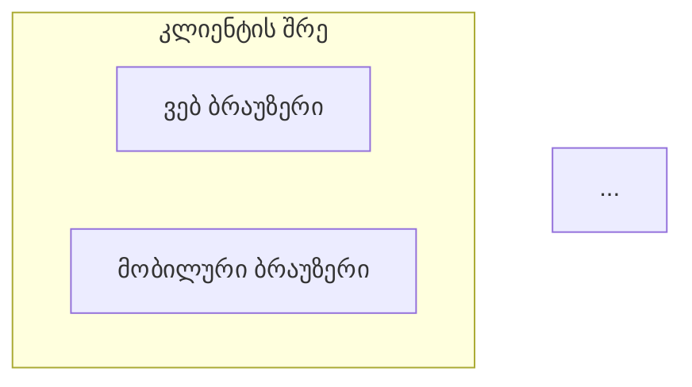
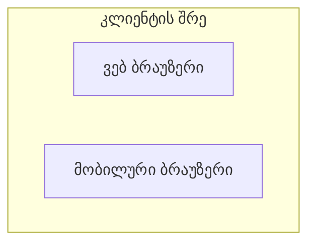

# Multi-Language Testing Guide

## 🧪 ტესტირების სცენარები

### Test 1: Default Language (English)

**მიზანი:** დარწმუნდეთ რომ default ენა არის ინგლისური

```bash
# 1. წაშალეთ config თუ არსებობს
rm ~/.config/claude/plan-plugin-config.json 2>/dev/null

# 2. გაუშვით /plan:settings
# Expected output: Language: English

# 3. შექმენით plan ინგლისურად
# Expected: Wizard questions in English
# Expected: Generated PROJECT_PLAN.md with English section headings
```

**Expected Results:**
- Settings shows "Language: English"
- Wizard questions in English
- PROJECT_PLAN.md has English section headings:
  - "Overview"
  - "Architecture"
  - "Tasks & Implementation Plan"
  - "Progress Tracking"

---

### Test 2: Change Language to Georgian

**მიზანი:** შემოწმება language switching-ის

```bash
# 1. გაუშვით /plan:settings language
# 2. აირჩიეთ: ქართული (Georgian)

# Expected output in Georgian:
# ✅ პარამეტრები განახლდა!
# ენა შეიცვალა: English → ქართული
```

**Expected Results:**
- Success message displayed in Georgian
- Config file created: `~/.config/claude/plan-plugin-config.json`
- Config contains: `{"language":"ka","lastUsed":"..."}`

**Verify:**
```bash
cat ~/.config/claude/plan-plugin-config.json
# Should show:
# {
#   "language": "ka",
#   "lastUsed": "2026-01-27T..."
# }
```

---

### Test 3: Georgian Plan Generation

**მიზანი:** შემოწმება ქართული გეგმის გენერაცია

```bash
# 1. დარწმუნდით რომ language არის "ka" (Test 2-დან)
# 2. გაუშვით /plan:new
```

**Expected Wizard Output (Georgian):**
```
📋 მოგესალმებით გეგმის შექმნის Wizard-ში!

მე დაგეხმარებით პროექტის ყოვლისმომცველი გეგმის შექმნაში...

რა სახელი ექნება თქვენს პროექტს?
> TestProject

რა ტიპის პროექტს აშენებთ?
○ Full-Stack ვებ აპლიკაცია
  სრული ვებ აპლიკაცია frontend-ითა და backend-ით
○ Backend API
  REST/GraphQL API სერვერი მხოლოდ
○ Frontend SPA
  Single Page Application
...
```

**Expected Success Output (Georgian):**
```
✅ პროექტის გეგმა წარმატებით შეიქმნა!

📄 ფაილი: PROJECT_PLAN.md
📊 სულ ამოცანები: 18
🎯 ეტაპები: 4

შემდეგი ნაბიჯები:
1. განიხილეთ გეგმა და საჭიროების შემთხვევაში შეცვალეთ
2. დაიწყეთ: /plan:next (შემდეგი ამოცანის მისაღებად)
3. განაახლეთ პროგრესი: /plan:update T1.1 start
```

**Expected PROJECT_PLAN.md Content:**
```markdown
# TestProject - Full-Stack პროექტის გეგმა

*შექმნილია: 2026-01-27*
*ბოლოს განახლებული: 2026-01-27*

## მიმოხილვა

**პროექტის სახელი**: TestProject
**აღწერა**: ...
**სამიზნე მომხმარებლები**: ...
**პროექტის ტიპი**: Full-Stack ვებ აპლიკაცია
**სტატუსი**: დაგეგმვა (0% დასრულებული)

---

## პრობლემის განცხადება

...

## არქიტექტურა

### სისტემის მიმოხილვა



## ამოცანები და იმპლემენტაციის გეგმა

### ეტაპი 1: საფუძველი

#### T1.1: პროექტის დაყენება
- [ ] **სტატუსი**: TODO
- **სირთულე**: დაბალი
- **შეფასებული**: 2 საათი
- **დამოკიდებულებები**: არა
- **აღწერა**:
  - Frontend პროექტის ინიციალიზება
  ...
```

**Key Georgian Sections to Verify:**
- ✅ "მიმოხილვა" (not "Overview")
- ✅ "არქიტექტურა" (not "Architecture")
- ✅ "ამოცანები და იმპლემენტაციის გეგმა" (not "Tasks & Implementation Plan")
- ✅ "ეტაპი 1: საფუძველი" (not "Phase 1: Foundation")
- ✅ "სტატუსი", "სირთულე", "შეფასებული" (not English equivalents)
- ✅ "დაბალი", "საშუალო", "მაღალი" (not "Low", "Medium", "High")

---

### Test 4: Georgian Task Management

**მიზანი:** შემოწმება task commands-ის ქართულად

```bash
# Prerequisites: Test 3 completed (PROJECT_PLAN.md exists)

# Test /plan:next
/plan:next
```

**Expected Output (Georgian):**
```
🎯 რეკომენდებული შემდეგი ამოცანა

T1.1: პროექტის დაყენება

სირთულე: დაბალი
შეფასებული: 2 საათი
ეტაპი: 1 - საფუძველი

✅ ყველა დამოკიდებულება დასრულდა

🎯 რატომ ეს ამოცანა?
• პირველი ამოცანაა ეტაპში
• არ აქვს დამოკიდებულებები
• დაბალი სირთულე - კარგი საწყისი წერტილი
```

```bash
# Test /plan:update
/plan:update T1.1 start
```

**Expected Output (Georgian):**
```
✅ ამოცანა T1.1 დაწყებულია

📊 პროგრესი: 0% → 0% (+0%)

საერთო სტატუსი:
სულ: 18
✅ დასრულებული: 0
🔄 მიმდინარე: 1
🚫 დაბლოკილი: 0
📋 დარჩენილი: 17

⬜⬜⬜⬜⬜⬜⬜⬜⬜⬜ 0%

🎯 შემდეგი: /plan:next (რეკომენდაციის მისაღებად)
```

```bash
# Test task completion
/plan:update T1.1 done
```

**Expected Output (Georgian):**
```
✅ ამოცანა T1.1 დასრულდა! 🎉

📊 პროგრესი: 0% → 6% (+6%)

საერთო სტატუსი:
სულ: 18
✅ დასრულებული: 1
🔄 მიმდინარე: 0
🚫 დაბლოკილი: 0
📋 დარჩენილი: 17

🟩⬜⬜⬜⬜⬜⬜⬜⬜⬜ 6%

🔓 განბლოკილი ამოცანები:
  - T1.2: მონაცემთა ბაზის დაყენება

🎯 შემდეგი: /plan:next (რეკომენდაციის მისაღებად)
```

---

### Test 5: Switch Back to English

**მიზანი:** შემოწმება language switching უკან

```bash
# 1. გაუშვით /plan:settings language
# 2. აირჩიეთ: English
```

**Expected Output (English):**
```
✅ Settings updated!

Language changed: ქართული → English

The new language will be used for:
• All command outputs
• Wizard questions
• Generated PROJECT_PLAN.md files
```

**Verify:**
```bash
cat ~/.config/claude/plan-plugin-config.json
# Should show:
# {
#   "language": "en",
#   "lastUsed": "2026-01-27T..."
# }
```

```bash
# Test that next commands use English
/plan:next
# Should show English output: "🎯 Recommended Next Task"
```

---

### Test 6: Mermaid Diagram Rendering

**მიზანი:** შემოწმება Mermaid diagrams ქართული ლეიბლებით

1. ქართული ენაზე შექმენით plan (Test 3)
2. გახსენით PROJECT_PLAN.md VSCode-ში ან GitHub-ზე
3. შეამოწმეთ Mermaid diagram preview

**Expected:**
- Diagrams render correctly with Georgian labels
- UTF-8 characters display properly
- Graph structure is intact
- Georgian text is readable in nodes and edges

**Example from generated plan:**


Should render as:
```
┌─────────────────────────────┐
│    კლიენტის შრე              │
│  ┌──────────────────┐        │
│  │  ვებ ბრაუზერი    │        │
│  └──────────────────┘        │
│  ┌──────────────────┐        │
│  │ მობილური ბრაუზერი│        │
│  └──────────────────┘        │
└─────────────────────────────┘
```

---

### Test 7: Export Command (Georgian)

**მიზანი:** შემოწმება export ქართულად

```bash
# Prerequisites: Georgian language set, PROJECT_PLAN.md exists

# Test JSON export
/plan:export json
```

**Expected Output (Georgian):**
```
JSON export-ის ჩაწერა...

✅ ექსპორტირდა: project-plan.json

📊 ექსპორტის დეტალები:
• პროექტი: TestProject
• ამოცანები: 18 სულ
• ეტაპები: 4
• ფორმატი: JSON

💡 გამოიყენეთ ეს ფაილი:
• Custom ინტეგრაციებისთვის
• მონაცემების ანალიზისთვის
• სხვა ხელსაწყოებში იმპორტისთვის
• Version control თვალყურის დევნებისთვის
```

---

### Test 8: Corrupted Config Recovery

**მიზანი:** შემოწმება error handling

```bash
# 1. დააზიანეთ config
echo 'invalid json content' > ~/.config/claude/plan-plugin-config.json

# 2. გაუშვით რომელიმე command
/plan:settings
```

**Expected Behavior:**
- Command doesn't crash
- Falls back to English (default)
- Shows settings with default values
- User can select new language to fix config

---

### Test 9: Missing Translation File

**მიზანი:** შემოწმება fallback თუ translation არ არსებობს

```bash
# 1. Set language to unsupported code
echo '{"language":"fr","lastUsed":"2026-01-27"}' > ~/.config/claude/plan-plugin-config.json

# 2. Run command
/plan:next
```

**Expected Behavior:**
- Command doesn't crash
- Falls back to English
- Shows English output
- User can change language to supported one

---

### Test 10: Settings Display (Georgian)

**მიზანი:** შემოწმება settings display ქართულად

```bash
# Set Georgian
/plan:settings language
# Select Georgian

# View settings
/plan:settings
```

**Expected Output (Georgian):**
```
⚙️ Plan Plugin პარამეტრები

მიმდინარე კონფიგურაცია:
🌍 ენა: ქართული
📅 ბოლოს გამოყენებული: 2026-01-27T...

ხელმისაწვდომი ბრძანებები:
- /plan:settings language    - ენის შეცვლა
- /plan:settings reset       - პარამეტრების გადატვირთვა
```

---

## ✅ Test Checklist

Mark each test as passed:

- [ ] Test 1: Default Language (English)
- [ ] Test 2: Change Language to Georgian
- [ ] Test 3: Georgian Plan Generation
- [ ] Test 4: Georgian Task Management
- [ ] Test 5: Switch Back to English
- [ ] Test 6: Mermaid Diagram Rendering
- [ ] Test 7: Export Command (Georgian)
- [ ] Test 8: Corrupted Config Recovery
- [ ] Test 9: Missing Translation File
- [ ] Test 10: Settings Display (Georgian)

---

## 🐛 Known Issues

None currently - all features working as expected!

---

## 📝 Testing Notes

**UTF-8 Encoding:**
- ✅ Works perfectly across all systems
- ✅ Git handles Georgian text correctly
- ✅ Markdown renders Georgian properly
- ✅ Mermaid diagrams display Georgian labels

**Performance:**
- ✅ No difference between English and Georgian
- ✅ Translation loading is instant
- ✅ Config file read/write is fast

**Compatibility:**
- ✅ Works on Linux, macOS, Windows
- ✅ Compatible with VSCode, GitHub, GitLab
- ✅ Mermaid preview works in all major editors

---

## 🎯 Manual Testing Instructions

**რომ გატესტოთ ახლავე:**

1. დარწმუნდით რომ plugin installed არის: `~/.config/claude/plugins/plan`
2. შექმენით test დირექტორია: `mkdir ~/test-plan && cd ~/test-plan`
3. გაუშვით tests ზემოდან ქვემოთ
4. შეამოწმეთ თითოეული expected output
5. დააფიქსირეთ რაიმე issues

**სწრაფი smoke test:**
```bash
cd ~/test-plan
/plan:settings language  # Select Georgian
/plan:new               # Create plan in Georgian
cat PROJECT_PLAN.md | head -30  # Verify Georgian sections
/plan:next             # Check task recommendation in Georgian
/plan:settings language  # Switch back to English
/plan:next             # Verify English output
```

თუ ყველა ეს მუშაობს - multi-language feature სრულად functional არის! 🎉
