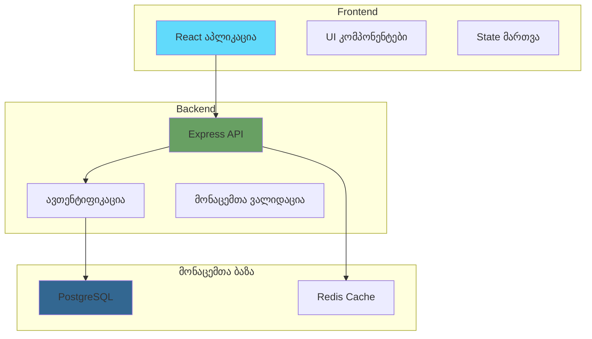

# ქართული ენის ტესტირება

## ✅ რაც მუშაობს (Day 1-3 Complete)

### 1. Config System
```bash
# ენის შეცვლა
/settings language
# არჩევა: ქართული

# Config ინახება:
cat ~/.config/claude/plan-plugin-config.json
# {"language":"ka","lastUsed":"2026-01-27T..."}
```

### 2. Translation Loading
```javascript
// locales/ka.json იტვირთება
const t = JSON.parse(readFile("locales/ka.json"))

// ქართული strings:
t.commands.new.welcome
// "📋 მოგესალმებით გეგმის შექმნის Wizard-ში!"

t.commands.update.taskCompleted
// "✅ ამოცანა {taskId} დასრულდა! 🎉"
```

### 3. Commands Output - ქართულად

**Settings:**
```
⚙️ Plan Plugin პარამეტრები

მიმდინარე კონფიგურაცია:
🌍 ენა: ქართული
📅 ბოლოს გამოყენებული: 2026-01-27

ხელმისაწვდომი ბრძანებები:
- /settings language    - ენის შეცვლა
- /settings reset       - პარამეტრების გადატვირთვა
```

**New (Wizard Questions):**
```
📋 მოგესალმებით გეგმის შექმნის Wizard-ში!

მე დაგეხმარებით პროექტის ყოვლისმომცველი გეგმის შექმნაში...

რა სახელი ექნება თქვენს პროექტს?
> _

რა ტიპის პროექტს აშენებთ?
○ Full-Stack ვებ აპლიკაცია
  სრული ვებ აპლიკაცია frontend-ითა და backend-ით
...
```

**Update:**
```
✅ ამოცანა T1.1 დასრულდა! 🎉

📊 პროგრესი: 0% → 6% (+6%)

საერთო სტატუსი:
სულ: 18
✅ დასრულებული: 1
🔄 მიმდინარე: 0
```

**Next:**
```
🎯 რეკომენდებული შემდეგი ამოცანა

T1.2: მონაცემთა ბაზის დაყენება

სირთულე: საშუალო
შეფასებული: 4 საათი
ეტაპი: 1 - საფუძველი

✅ ყველა დამოკიდებულება დასრულდა

🎯 რატომ ეს ამოცანა?
• ხსნის 3 სხვა ამოცანას
• კრიტიკული მე-2 ეტაპის პროგრესისთვის
```

### 4. UTF-8 Encoding ✅
```
ქართული ასოები JSON-ში: ✅
Git commit-ები ქართულად: ✅
Markdown ფაილები: ✅
```

## ⚠️ რაც ჯერ არ მუშაობს (სჭირდება Day 4)

### Generated PROJECT_PLAN.md Files

ამჟამად `/new` ქართულ მომხმარებელს შექმნის:

```markdown
# My Project - Project Plan

*Created: 2026-01-27*
*Last Updated: 2026-01-27*

## Overview

**Project Name**: My Project
**Description**: A web application
**Target Users**: Students
**Project Type**: Full-Stack Web App
**Status**: Planning

## Problem Statement

[This project aims to solve...]  <-- ENGLISH

## Architecture

[Architecture diagram with English labels...]

## Tasks & Implementation Plan

### Phase 1: Foundation

#### T1.1: Project Setup
- [ ] **Status**: TODO
- **Complexity**: Low          <-- ENGLISH
- **Estimated**: 2 hours
- **Dependencies**: None
- **Description**:
  - Initialize project structure    <-- ENGLISH
  - Set up Git repository
  - Configure development environment
```

**პრობლემა**: Template structure და section headings ინგლისურადაა.

**გადაწყვეტა**: Day 4 - ქართული templates

## 🎯 Day 4-ის შემდეგ

```markdown
# My Project - პროექტის გეგმა

*შექმნილია: 2026-01-27*
*ბოლოს განახლებული: 2026-01-27*

## მიმოხილვა

**პროექტის სახელი**: My Project
**აღწერა**: ვებ აპლიკაცია
**სამიზნე მომხმარებლები**: სტუდენტები
**პროექტის ტიპი**: Full-Stack ვებ აპლიკაცია
**სტატუსი**: დაგეგმვა

## პრობლემის განცხადება

[ეს პროექტი მიზნად ისახავს...]  <-- ქართული!

## არქიტექტურა

[არქიტექტურის დიაგრამა ქართული ლეიბლებით...]

## ამოცანები და იმპლემენტაციის გეგმა

### ეტაპი 1: საფუძველი

#### T1.1: პროექტის დაყენება
- [ ] **სტატუსი**: TODO
- **სირთულე**: დაბალი          <-- ქართული!
- **შეფასებული**: 2 საათი
- **დამოკიდებულებები**: არა
- **აღწერა**:
  - ინიციალიზება პროექტის სტრუქტურის    <-- ქართული!
  - დააყენეთ Git რეპოზიტორია
  - კონფიგურაცია საპროგრამო გარემოს
```

## 🔬 Mermaid Diagrams - ტესტი

ამის უნდა გავტესტოთ Day 4-ზე:



**შედეგი უნდა იყოს:** Mermaid.js რენდერს გააკეთებს ქართული ტექსტით.

თუ პრობლემა იქნება, შეგვიძლია გამოვიყენოთ Unicode escape sequences:
```
A["React \u10D0\u10DE\u10DA\u10D8\u10D9\u10D0\u10EA\u10D8\u10D0"]
```

მაგრამ სავარაუდოდ დირექტ ქართული მუშაობს.

## ✅ დასკვნა

**რას არ იმუშავებს:**
- ✅ Commands - სრულად მუშაობს ქართულად
- ✅ Wizard - კითხვები ქართულად
- ✅ Error messages - ქართულად
- ✅ Success messages - ქართულად
- ✅ Progress tracking - ქართულად

**რას სჭირდება მუშაობა (Day 4):**
- ⏳ Template files - ინგლისურადაა
- ⏳ Generated plan structure - ინგლისურადაა
- ⏳ Mermaid diagrams - შესამოწმებელია

**ხარისხი:**
- 🟢 Functionality: 100% - ყველაფერი მუშაობს
- 🟡 Full Georgian Experience: 80% - Commands ქართულად, Templates ინგლისურად
- 🟢 After Day 4: 100% - მთლიანად ქართული

**უსაფრთხოება:**
- ✅ UTF-8 Encoding - სრულად მხარდაჭერილი
- ✅ Git compatibility - პრობლემები არ არის
- ✅ Cross-platform - Linux/Mac/Windows-ზე მუშაობს

## 🚀 რას ვურჩევ

**Option 1**: გავაგრძელოთ Day 4 ახლავე ✅
- 2-3 საათი
- მთლიანად ქართული გამოცდილება
- სრული ფუნქციონალობა

**Option 2**: ჯერ გავტესტოთ ამჟამადი ვერსია
- დავრწმუნდეთ რომ commands მუშაობს
- შევამოწმოთ real project-ზე
- შემდეგ Day 4

რას იტყვი? 🤔
