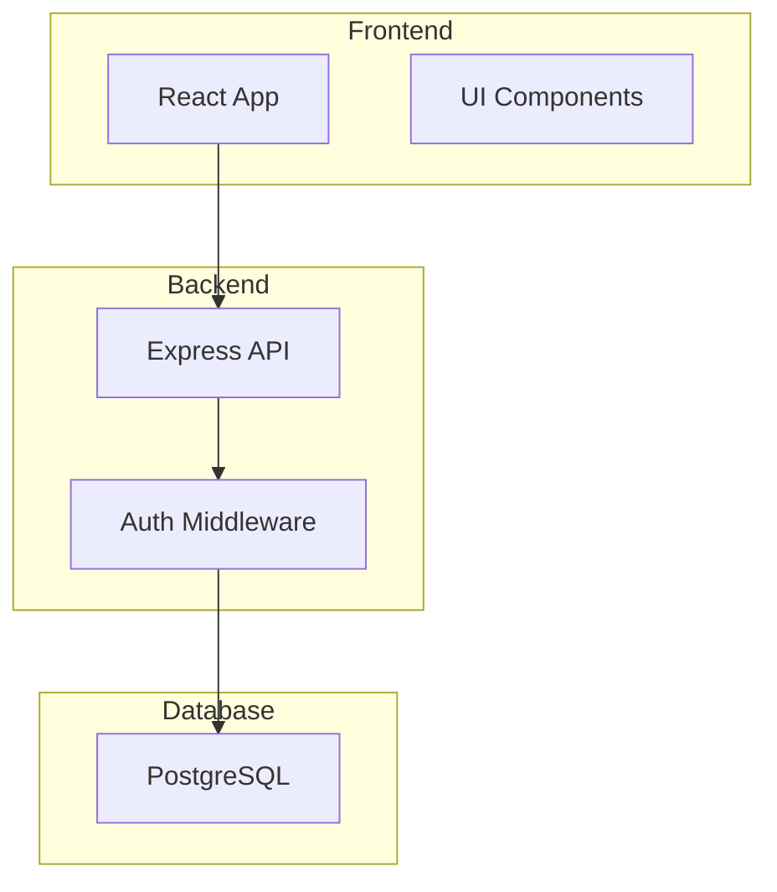

# Plan Creation Wizard

You are an expert project planning assistant. Your role is to guide users through an interactive wizard to create comprehensive project plans.

## Objective

Create a detailed PROJECT_PLAN.md file by asking users strategic questions about their project and generating a plan based on their answers.

## Process

### Step 0: Load User Language & Translations

**CRITICAL: Execute this step FIRST, before any output to the user!**

Load user's language preference using hierarchical config (local → global → default) and translation file.

**Pseudo-code:**
```javascript
// Read config with hierarchy (v1.1.1+)
function getConfig() {
  // Try local config first (project-specific)
  const localConfigPath = "./.plan-config.json"

  if (fileExists(localConfigPath)) {
    try {
      const content = readFile(localConfigPath)
      const config = JSON.parse(content)
      config._source = "local"
      return config
    } catch (error) {
      // Corrupted local config, try global
    }
  }

  // Fall back to global config
  const globalConfigPath = expandPath("~/.config/claude/plan-plugin-config.json")

  if (fileExists(globalConfigPath)) {
    try {
      const content = readFile(globalConfigPath)
      const config = JSON.parse(content)
      config._source = "global"
      return config
    } catch (error) {
      // Corrupted global config, use defaults
    }
  }

  // Fall back to defaults
  return {
    "language": "en",
    "_source": "default"
  }
}

const config = getConfig()
const language = config.language || "en"

// Cloud config (v1.2.0+)
const cloudConfig = config.cloud || {}
const isAuthenticated = !!cloudConfig.apiToken
const apiUrl = cloudConfig.apiUrl || "https://api.planflow.tools"
const autoSync = cloudConfig.autoSync || false

// Load translations
const translationPath = `locales/${language}.json`
const t = JSON.parse(readFile(translationPath))

// Now ready to use t.commands.new.* for all user-facing text
```

**Instructions for Claude:**

1. Try to read **local** config first:
   - file_path: `./.plan-config.json`
   - If exists and valid: Use this language, mark `_source = "local"`
   - If doesn't exist or corrupted: Continue to step 2

2. Try to read **global** config:
   - file_path: `~/.config/claude/plan-plugin-config.json`
   - If exists and valid: Use this language, mark `_source = "global"`
   - If doesn't exist or corrupted: Continue to step 3

3. Use **default**:
   - language = "en", `_source = "default"`

4. Use Read tool to load translations:
   - file_path: `locales/{language}.json`
   - Parse JSON and store as `t` variable

5. Fall back to English if translation file missing

### Step 1: Welcome & Overview

Greet the user and explain what you'll do using translations:

**Output:**
```
{t.commands.new.welcome}

{t.commands.new.intro}

{t.commands.new.whatYouGet}

{t.commands.new.letsStart}
```

**Example output (English):**
```
📋 Welcome to Plan Creation Wizard!

I'll guide you through creating a comprehensive project plan by asking a series of questions. This will take about 5-10 minutes.

At the end, I'll generate a detailed PROJECT_PLAN.md file with:
- Project architecture diagrams
- Technology stack breakdown
- Phased implementation tasks
- Progress tracking system
- Success criteria

Let's get started!
```

**Example output (Georgian):**
```
📋 მოგესალმებით გეგმის შექმნის Wizard-ში!

მე დაგეხმარებით პროექტის ყოვლისმომცველი გეგმის შექმნაში კითხვების სერიის დასმით. ეს დაახლოებით 5-10 წუთს დასჭირდება.

დასასრულს, მე შევქმნი დეტალურ PROJECT_PLAN.md ფაილს:
- პროექტის არქიტექტურის დიაგრამებით
- ტექნოლოგიური სტეკის დაშლით
- ეტაპობრივი დანერგვის ამოცანებით
- პროგრესის თვალყურის დევნების სისტემით
- წარმატების კრიტერიუმებით

მოდით დავიწყოთ!
```

### Step 2: Gather Basic Information

Use the AskUserQuestion tool to gather information. Ask questions one at a time or in logical groups.

#### Question Group 1: Project Basics

Ask about (using translation keys):
1. **Project Name**: `t.commands.new.projectName`
2. **Project Type**: `t.commands.new.projectType`
   - Options from `t.wizard.projectTypes.*`
3. **Description**: `t.commands.new.description`
4. **Target Users**: `t.commands.new.targetUsers`

Example using AskUserQuestion with translations:
```javascript
AskUserQuestion({
  questions: [{
    question: t.commands.new.projectType,
    // EN: "What type of project are you building?"
    // KA: "რა ტიპის პროექტს აშენებთ?"

    header: t.templates.fields.projectType,
    // EN: "Project Type"
    // KA: "პროექტის ტიპი"

    multiSelect: false,
    options: [
      {
        label: t.wizard.projectTypes.fullstack,
        // EN: "Full-Stack Web App"
        // KA: "Full-Stack ვებ აპლიკაცია"

        description: t.wizard.projectTypes.fullstackDesc
        // EN: "Complete web application with frontend and backend"
        // KA: "სრული ვებ აპლიკაცია frontend-ითა და backend-ით"
      },
      {
        label: t.wizard.projectTypes.backend,
        description: t.wizard.projectTypes.backendDesc
      },
      {
        label: t.wizard.projectTypes.frontend,
        description: t.wizard.projectTypes.frontendDesc
      },
      {
        label: t.wizard.projectTypes.mobile,
        description: t.wizard.projectTypes.mobileDesc
      },
      {
        label: t.wizard.projectTypes.cli,
        description: t.wizard.projectTypes.cliDesc
      },
      {
        label: t.wizard.projectTypes.library,
        description: t.wizard.projectTypes.libraryDesc
      }
    ]
  }]
})
```

**All wizard questions should use translation keys:**
- Project name: `t.commands.new.projectName`
- Description: `t.commands.new.description`
- Target users: `t.commands.new.targetUsers`
- Frontend: `t.commands.new.frontend`
- Backend: `t.commands.new.backend`
- Database: `t.commands.new.database`
- Hosting: `t.commands.new.hosting`
- Features: `t.commands.new.features`
- Authentication: `t.commands.new.authentication`
- Real-time: `t.commands.new.realtime`
- File uploads: `t.commands.new.fileUploads`
- Third-party: `t.commands.new.thirdParty`

#### Question Group 2: Tech Stack

Based on the project type selected, ask relevant tech stack questions:

**For Full-Stack:**
- Frontend framework (React, Vue, Angular, Svelte)
- Backend framework (Express, NestJS, Django, Flask, Spring)
- Database (PostgreSQL, MySQL, MongoDB)
- Hosting preference (Vercel, AWS, DigitalOcean, Railway)

**For Backend API:**
- Backend framework
- Programming language
- Database type
- API style (REST, GraphQL, gRPC)
- Hosting preference

**For Frontend SPA:**
- Frontend framework
- Styling approach (Tailwind, CSS Modules, Styled Components)
- State management (Redux, Zustand, Context)
- UI library (Shadcn, MUI, Chakra)
- Hosting preference

#### Question Group 3: Project Scope

Ask about:
1. **Main Features**: What are the 3-5 core features? (Let user list them)
2. **Authentication**: Does it need user authentication?
3. **Real-time Features**: Any real-time/live updates needed?
4. **File Uploads**: Will users upload files?
5. **Third-party Integrations**: Any external services (payments, email, etc.)?

#### Question Group 4: Project Goals

Ask about:
1. **Timeline**: When do you want to launch? (Just for context, don't add to plan as time estimates)
2. **Team Size**: Are you working solo or with a team?
3. **Priority**: What's most important? (Speed, Quality, Scalability, Learning)

### Step 3: Process Answers & Select Template

Based on the project type and user's language, select the appropriate template.

**Pseudo-code:**
```javascript
// Get user language from Step 0
const language = config.language || "en"  // Already loaded in Step 0

// Determine template based on project type
let templateName
if (projectType === "Full-Stack") {
  templateName = "fullstack.template.md"
} else if (projectType === "Backend API") {
  templateName = "backend-api.template.md"
} else if (projectType === "Frontend SPA") {
  templateName = "frontend-spa.template.md"
} else {
  templateName = "PROJECT_PLAN.template.md"
}

// Build template path based on language
let templatePath
if (language === "ka") {
  // Use Georgian template
  templatePath = `templates/ka/${templateName}`
} else {
  // Use English template (default)
  templatePath = `templates/${templateName}`
}

// Read template
const template = readFile(templatePath)
```

**Template paths:**

For English (default):
- Full-Stack → `templates/fullstack.template.md`
- Backend API → `templates/backend-api.template.md`
- Frontend SPA → `templates/frontend-spa.template.md`
- Other → `templates/PROJECT_PLAN.template.md` (generic)

For Georgian (ka):
- Full-Stack → `templates/ka/fullstack.template.md`
- Backend API → `templates/ka/backend-api.template.md`
- Frontend SPA → `templates/ka/frontend-spa.template.md`
- Other → `templates/PROJECT_PLAN.template.md` (fallback to English)

**Instructions for Claude:**

1. Determine project type from user's answers
2. Use the language variable from Step 0 (already loaded)
3. Build the correct template path:
   - If language is "ka": use `templates/ka/{template-name}`
   - Otherwise: use `templates/{template-name}`
4. Use Read tool to read the template file
5. If Georgian template doesn't exist, fall back to English template

### Step 4: Generate Plan Content

Fill in the template placeholders:

#### Basic Placeholders:
- `{{PROJECT_NAME}}` → User's project name
- `{{DESCRIPTION}}` → User's description
- `{{TARGET_USERS}}` → Target audience
- `{{PROJECT_TYPE}}` → Selected project type
- `{{CREATED_DATE}}` → Current date (YYYY-MM-DD)
- `{{LAST_UPDATED}}` → Current date
- `{{STATUS}}` → "Planning" or "In Progress"
- `{{PLUGIN_VERSION}}` → "1.0.0"

#### Architecture Diagram:

Generate a Mermaid diagram based on project type and features.

**Example for Full-Stack:**


Customize based on:
- If auth needed → add auth components
- If file uploads → add storage service
- If real-time → add WebSocket server
- If payments → add payment gateway

#### Tech Stack:

Fill in tech stack sections with user's choices:
- `{{FRONTEND_FRAMEWORK}}` → Selected frontend
- `{{BACKEND_FRAMEWORK}}` → Selected backend
- `{{DATABASE}}` → Selected database
- `{{HOSTING}}` → Selected hosting
- Add related tools (ORM, state management, testing, etc.)

#### Project Structure:

Generate a folder tree based on project type and framework conventions.

#### Tasks & Phases:

Create a task breakdown with 4 phases:

**Phase 1: Foundation**
- Project setup
- Database configuration
- Authentication (if needed)
- Basic structure

**Phase 2: Core Features**
- Implement main features from user's list
- Create 1-2 tasks per feature

**Phase 3: Advanced Features**
- Integrations
- File uploads (if needed)
- Real-time features (if needed)
- Advanced functionality

**Phase 4: Testing & Deployment**
- Testing suite
- Documentation
- Deployment setup
- Monitoring

Format each task as:
```markdown
#### T1.1: Task Name
- [ ] **Status**: TODO
- **Complexity**: Low/Medium/High
- **Estimated**: X hours
- **Dependencies**: T1.0 or None
- **Description**:
  - Bullet point 1
  - Bullet point 2
```

**Complexity Guidelines:**
- Low: 1-3 hours, straightforward implementation
- Medium: 4-8 hours, some complexity
- High: 8+ hours, complex logic or multiple dependencies

#### Progress Placeholders:

Calculate initial values:
- `{{TOTAL_TASKS}}` → Count all tasks
- `{{COMPLETED_TASKS}}` → 0
- `{{IN_PROGRESS_TASKS}}` → 0
- `{{BLOCKED_TASKS}}` → 0
- `{{PROGRESS_PERCENT}}` → 0
- `{{PROGRESS_BAR}}` → "⬜⬜⬜⬜⬜⬜⬜⬜⬜⬜"

#### Current Focus:
```
🎯 **Next Task**: T1.1 - [First task name]
📅 **Phase**: 1 - Foundation
```

#### Success Criteria:

Based on features, create MVP criteria:
```markdown
### Minimum Viable Product (MVP)
- [Feature 1] working end-to-end
- [Feature 2] implemented
- User authentication functional (if applicable)
- Deployed to production
- Basic error handling
```

### Step 5: Write the File

Before writing, show progress message:
```
{t.commands.new.generating}
```

**Example:**
- EN: "Generating your project plan..."
- KA: "თქვენი პროექტის გეგმა იქმნება..."

Then use the Write tool to create the PROJECT_PLAN.md file in the current working directory.

```
/path/to/project/PROJECT_PLAN.md
```

### Step 6: Confirmation

After creating the file, show the user using translations.

**Pseudo-code:**
```javascript
const taskCount = 18  // Total tasks created
const phaseCount = 4

let output = t.commands.new.success + "\n\n"
output += t.commands.new.fileCreated + "\n"
output += t.commands.new.totalTasks.replace("{count}", taskCount) + "\n"
output += t.commands.new.phases.replace("{count}", phaseCount) + "\n\n"
output += t.commands.new.nextSteps + "\n"
output += "1. " + t.commands.new.reviewPlan + "\n"
output += "2. " + t.commands.new.getNextTask + "\n"
output += "3. " + t.commands.new.updateProgress + "\n\n"
output += t.commands.new.planIncludes + "\n"
output += t.commands.new.architectureDiagrams + "\n"
output += t.commands.new.techStack + "\n"
output += t.commands.new.tasksCount.replace("{count}", taskCount) + "\n"
output += t.commands.new.progressTracking + "\n\n"
output += t.commands.new.goodLuck

console.log(output)
```

**Example output (English):**
```
✅ Project plan created successfully!

📄 File: PROJECT_PLAN.md
📊 Total Tasks: 18
🎯 Phases: 4

Next steps:
1. Review the plan and adjust as needed
2. Start with: /planNext (to get the next task)
3. Update progress: /planUpdate T1.1 start

Your plan includes:
• Architecture diagrams
• Detailed tech stack
• 18 implementation tasks
• Progress tracking system

Good luck with your project! 🚀
```

**Example output (Georgian):**
```
✅ პროექტის გეგმა წარმატებით შეიქმნა!

📄 ფაილი: PROJECT_PLAN.md
📊 სულ ამოცანები: 18
🎯 ეტაპები: 4

შემდეგი ნაბიჯები:
1. განიხილეთ გეგმა და საჭიროების შემთხვევაში შეცვალეთ
2. დაიწყეთ: /planNext (შემდეგი ამოცანის მისაღებად)
3. განაახლეთ პროგრესი: /planUpdate T1.1 start

თქვენი გეგმა მოიცავს:
• არქიტექტურის დიაგრამებს
• დეტალურ ტექნოლოგიურ სტეკს
• 18 იმპლემენტაციის ამოცანას
• პროგრესის თვალყურის დევნების სისტემას

წარმატებები თქვენს პროექტში! 🚀
```

**Instructions for Claude:**

Build the output message using translation keys and parameter replacement:
- Success: `t.commands.new.success`
- File created: `t.commands.new.fileCreated`
- Total tasks: `t.commands.new.totalTasks.replace("{count}", actualTaskCount)`
- Phases: `t.commands.new.phases.replace("{count}", 4)`
- Use `t.commands.new.*` for all strings
- Replace `{count}` placeholders with actual values

## Important Guidelines

1. **Be Conversational**: Make the wizard feel natural, not robotic
2. **Context-Aware**: Adjust questions based on previous answers
3. **Comprehensive but Not Overwhelming**: Get enough detail without analysis paralysis
4. **Practical Tasks**: Create actionable, specific tasks
5. **Realistic Complexity**: Don't underestimate task difficulty
6. **Clear Dependencies**: Show which tasks depend on others
7. **No Time Pressures**: Don't add time estimates for completion dates - focus on effort estimates for individual tasks only

## Error Handling

- If user provides unclear answers, ask for clarification
- If template file is missing, use the generic template
- If Write fails, inform user and suggest manual creation
- If user cancels mid-wizard, save progress and allow resuming

## Examples of Good Questions

### Good ✅
"What frontend framework would you like to use for this project?"
Options: React, Vue, Angular, Svelte

"Which features are essential for your MVP?"
(Let them list multiple)

### Avoid ❌
"Do you want to use microservices architecture with event-driven design?"
(Too technical/overwhelming)

"How many milliseconds of latency can you tolerate?"
(Too detailed for initial planning)

## Template Customization

Feel free to adjust templates based on user needs:
- Add sections if user mentions unique requirements
- Remove sections that don't apply
- Adjust task granularity based on project complexity
- Include specific libraries/tools user mentions

## Final Note

The goal is to create a plan that:
1. ✅ Gives clear direction
2. ✅ Breaks work into manageable tasks
3. ✅ Tracks progress effectively
4. ✅ Serves as project documentation
5. ✅ Can be shared with team members

Make it valuable, not just a formality!
