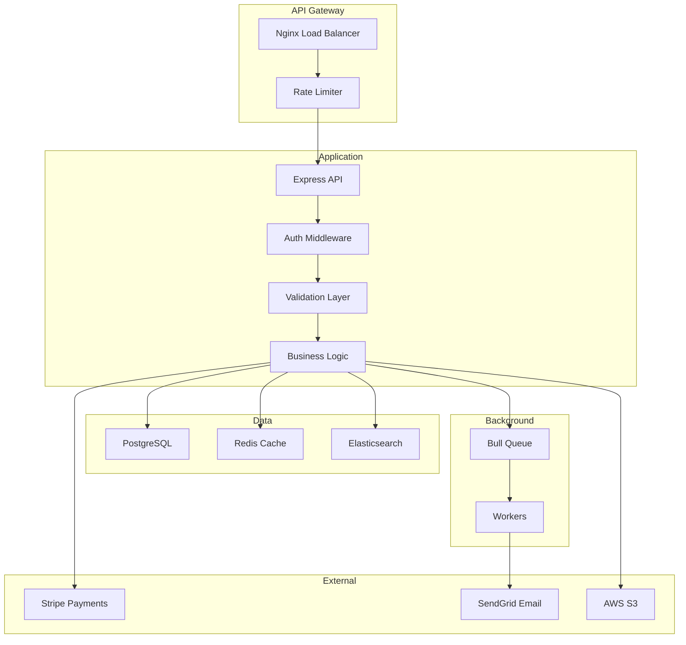

# E-Commerce API - Backend Project Plan

*Generated: 2026-01-26*
*Last Updated: 2026-01-26*

## Overview

**Project Name**: E-Commerce REST API

**Description**: Scalable RESTful API for e-commerce platform with product catalog, cart, checkout, and order management.

**Target Users**: Frontend developers, mobile app developers, and third-party integrations

**Project Type**: Backend API

**Status**: Planning (0% complete)

---

## Architecture

### System Overview



---

## Tech Stack

### Backend
- **Framework**: Express.js + TypeScript
- **Authentication**: JWT + Refresh Tokens
- **Validation**: Zod
- **ORM**: Prisma
- **API Docs**: Swagger/OpenAPI

### Database
- **Primary**: PostgreSQL 15
- **Cache**: Redis 7
- **Search**: Elasticsearch 8
- **Queue**: Bull (Redis-based)

### External Services
- **Payments**: Stripe
- **Email**: SendGrid
- **Storage**: AWS S3
- **Monitoring**: Sentry

### DevOps
- **Hosting**: AWS EC2 / Railway
- **CI/CD**: GitHub Actions
- **Containerization**: Docker + Docker Compose

---

## API Endpoints

### Authentication
```
POST   /api/auth/register
POST   /api/auth/login
POST   /api/auth/logout
POST   /api/auth/refresh
POST   /api/auth/forgot-password
POST   /api/auth/reset-password
```

### Products
```
GET    /api/products
GET    /api/products/:id
POST   /api/products          (Admin)
PUT    /api/products/:id      (Admin)
DELETE /api/products/:id      (Admin)
GET    /api/products/search?q=
```

### Cart
```
GET    /api/cart
POST   /api/cart/items
PUT    /api/cart/items/:id
DELETE /api/cart/items/:id
DELETE /api/cart/clear
```

### Orders
```
GET    /api/orders
GET    /api/orders/:id
POST   /api/orders/checkout
PUT    /api/orders/:id/cancel
```

### Users (Admin)
```
GET    /api/users
GET    /api/users/:id
PUT    /api/users/:id
DELETE /api/users/:id
```

---

## Tasks & Implementation Plan

### Phase 1: Foundation (Est: 16 hours)

#### T1.1: Project Setup
- [ ] **Status**: TODO
- **Complexity**: Low
- **Estimated**: 2 hours
- **Dependencies**: None
- **Description**:
  - Initialize Express + TypeScript project
  - Configure ESLint + Prettier
  - Setup folder structure
  - Create .env.example
  - Initialize Git

**Files to create:**
```
src/
├── controllers/
├── services/
├── models/
├── routes/
├── middleware/
├── utils/
├── config/
└── index.ts
```

#### T1.2: Database Configuration
- [ ] **Status**: TODO
- **Complexity**: Medium
- **Estimated**: 4 hours
- **Dependencies**: T1.1
- **Description**:
  - Setup PostgreSQL connection
  - Configure Prisma ORM
  - Create database schemas:
    - Users (id, email, password, role, etc.)
    - Products (id, name, price, stock, etc.)
    - Orders (id, userId, status, total, etc.)
    - OrderItems (id, orderId, productId, quantity, etc.)
  - Create migrations
  - Seed sample data

#### T1.3: Authentication System
- [ ] **Status**: TODO
- **Complexity**: High
- **Estimated**: 8 hours
- **Dependencies**: T1.2
- **Description**:
  - Install JWT and bcrypt
  - Create User model
  - Implement registration endpoint
  - Implement login endpoint
  - Generate access + refresh tokens
  - Create auth middleware
  - Implement token refresh
  - Add password reset flow

#### T1.4: Core Middleware
- [ ] **Status**: TODO
- **Complexity**: Low
- **Estimated**: 2 hours
- **Dependencies**: T1.1
- **Description**:
  - Error handling middleware
  - Request logging (Morgan)
  - CORS configuration
  - Rate limiting (express-rate-limit)
  - Request validation middleware
  - Helmet.js security headers

---

### Phase 2: Product Management (Est: 20 hours)

#### T2.1: Product Model & CRUD
- [ ] **Status**: TODO
- **Complexity**: Medium
- **Estimated**: 6 hours
- **Dependencies**: T1.2
- **Description**:
  - Create Product schema
  - GET /products (with pagination)
  - GET /products/:id
  - POST /products (admin only)
  - PUT /products/:id (admin only)
  - DELETE /products/:id (admin only)
  - Add input validation
  - Add image upload (S3)

#### T2.2: Product Search
- [ ] **Status**: TODO
- **Complexity**: High
- **Estimated**: 8 hours
- **Dependencies**: T2.1
- **Description**:
  - Setup Elasticsearch
  - Index products
  - Implement search endpoint
  - Add filters (category, price range)
  - Add sorting options
  - Implement pagination
  - Optimize query performance

#### T2.3: Product Categories
- [ ] **Status**: TODO
- **Complexity**: Medium
- **Estimated**: 4 hours
- **Dependencies**: T2.1
- **Description**:
  - Create Category model
  - GET /categories
  - GET /categories/:id/products
  - POST /categories (admin)
  - Hierarchical category support

#### T2.4: Inventory Management
- [ ] **Status**: TODO
- **Complexity**: Medium
- **Estimated**: 4 hours
- **Dependencies**: T2.1
- **Description**:
  - Track stock levels
  - Decrease stock on order
  - Low stock alerts
  - Stock reservation logic
  - Prevent overselling

---

### Phase 3: Cart & Checkout (Est: 24 hours)

#### T3.1: Shopping Cart
- [ ] **Status**: TODO
- **Complexity**: Medium
- **Estimated**: 6 hours
- **Dependencies**: T2.1, T1.3
- **Description**:
  - Create Cart model
  - GET /cart (user's cart)
  - POST /cart/items (add item)
  - PUT /cart/items/:id (update quantity)
  - DELETE /cart/items/:id (remove)
  - DELETE /cart/clear
  - Calculate cart total
  - Handle stock validation

#### T3.2: Checkout Process
- [ ] **Status**: TODO
- **Complexity**: High
- **Estimated**: 10 hours
- **Dependencies**: T3.1
- **Description**:
  - Create Order model
  - POST /orders/checkout
  - Validate cart items and stock
  - Calculate totals and taxes
  - Create order record
  - Integrate Stripe payment
  - Handle payment webhook
  - Send order confirmation email
  - Clear cart after checkout

#### T3.3: Order Management
- [ ] **Status**: TODO
- **Complexity**: Medium
- **Estimated**: 5 hours
- **Dependencies**: T3.2
- **Description**:
  - GET /orders (user's orders)
  - GET /orders/:id (order details)
  - PUT /orders/:id/cancel
  - Order status updates
  - Admin order management
  - Order history

#### T3.4: Payment Processing
- [ ] **Status**: TODO
- **Complexity**: High
- **Estimated**: 6 hours
- **Dependencies**: T3.2
- **Description**:
  - Stripe integration
  - Create payment intent
  - Handle payment confirmation
  - Refund processing
  - Payment webhook handling
  - Failed payment retry logic

---

### Phase 4: Advanced Features (Est: 18 hours)

#### T4.1: Caching Layer
- [ ] **Status**: TODO
- **Complexity**: Medium
- **Estimated**: 4 hours
- **Description**:
  - Setup Redis
  - Cache product listings
  - Cache product details
  - Cache invalidation on updates
  - Cache warming scripts

#### T4.2: Background Jobs
- [ ] **Status**: TODO
- **Complexity**: High
- **Estimated**: 6 hours
- **Description**:
  - Setup Bull queue
  - Email sending jobs
  - Order processing jobs
  - Stock update jobs
  - Report generation jobs
  - Job monitoring dashboard

#### T4.3: Admin Dashboard API
- [ ] **Status**: TODO
- **Complexity**: Medium
- **Estimated**: 5 hours
- **Description**:
  - Sales analytics endpoint
  - Revenue reports
  - Top products
  - User statistics
  - Order metrics

#### T4.4: API Rate Limiting & Security
- [ ] **Status**: TODO
- **Complexity**: Medium
- **Estimated**: 3 hours
- **Description**:
  - Implement rate limiting per IP
  - Add API key authentication
  - SQL injection prevention
  - XSS protection
  - Request size limits
  - Security headers

---

### Phase 5: Testing & Deployment (Est: 16 hours)

#### T5.1: Testing Suite
- [ ] **Status**: TODO
- **Complexity**: High
- **Estimated**: 10 hours
- **Description**:
  - Unit tests for services
  - Integration tests for API
  - Test database setup
  - Mock external services
  - Achieve >80% coverage

#### T5.2: API Documentation
- [ ] **Status**: TODO
- **Complexity**: Low
- **Estimated**: 3 hours
- **Description**:
  - Generate Swagger/OpenAPI docs
  - Add endpoint descriptions
  - Include request/response examples
  - Document error codes
  - Create Postman collection

#### T5.3: Production Deployment
- [ ] **Status**: TODO
- **Complexity**: High
- **Estimated**: 6 hours
- **Description**:
  - Create Dockerfile
  - Setup Docker Compose
  - Configure production environment
  - Setup SSL/TLS
  - Deploy to AWS/Railway
  - Configure auto-scaling
  - Setup monitoring and alerts
  - Configure database backups

---

## Progress Tracking

### Overall Status
**Total Tasks**: 19
**Completed**: 0 ⬜⬜⬜⬜⬜⬜⬜⬜⬜⬜ (0%)
**In Progress**: 0
**Blocked**: 0

### Phase Progress
- 🟢 Phase 1: Foundation → 0/4 (0%)
- 🔵 Phase 2: Product Management → 0/4 (0%)
- 🟣 Phase 3: Cart & Checkout → 0/4 (0%)
- 🟠 Phase 4: Advanced Features → 0/4 (0%)
- 🔴 Phase 5: Testing & Deployment → 0/3 (0%)

### Current Focus
🎯 **Next Task**: T1.1 - Project Setup
📅 **Phase**: 1 - Foundation

### Estimated Timeline
- **Total Estimated Time**: 94 hours
- **Phase 1**: 16 hours
- **Phase 2**: 20 hours
- **Phase 3**: 24 hours
- **Phase 4**: 18 hours
- **Phase 5**: 16 hours

---

## Performance Benchmarks

### Target Metrics
- **Response Time**: < 200ms (95th percentile)
- **Throughput**: 1000+ requests/second
- **Availability**: 99.9% uptime
- **Error Rate**: < 0.1%

---

## Security Considerations

- HTTPS only in production
- JWT token expiration (15 min access, 7 days refresh)
- Rate limiting (100 requests/15 min per IP)
- Input validation on all endpoints
- SQL injection prevention (Prisma parameterized queries)
- Password hashing with bcrypt (10 rounds)
- CORS configured for known origins
- Helmet.js security headers
- API key authentication for admin endpoints

---

*Generated by plan-plugin v1.0.0*
*Example plan for a backend API project*
