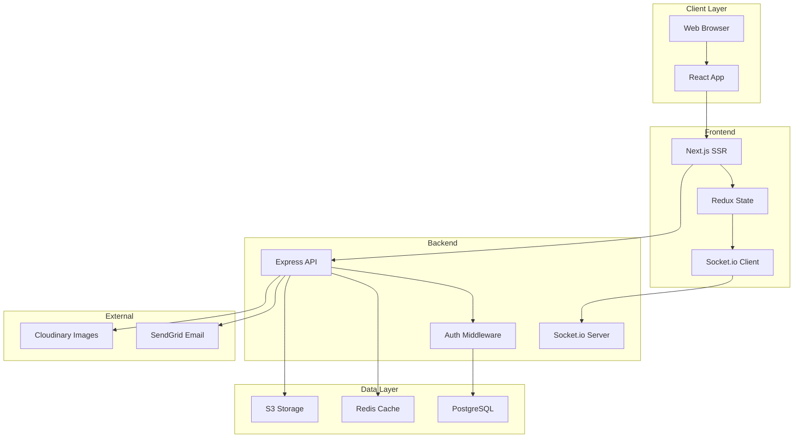

# TaskMaster - Full-Stack Project Plan

*Generated: 2026-01-26*
*Last Updated: 2026-01-26*

## Overview

**Project Name**: TaskMaster

**Description**: Team task management application with real-time collaboration, kanban boards, and progress tracking.

**Target Users**: Development teams, project managers, and remote workers who need collaborative task management

**Project Type**: Full-Stack Web Application

**Status**: In Progress (35% complete)

---

## Problem Statement

**Current Pain Points:**
1. Existing tools are too complex or too simple
2. Poor real-time collaboration features
3. Difficult to visualize project progress
4. No good integration between planning and execution
5. Team communication scattered across tools

**Solution:**
- Simple, intuitive kanban-style task boards
- Real-time updates when team members make changes
- Visual progress tracking with charts and analytics
- Built-in comments and mentions for task discussions
- All-in-one workspace for planning and execution

**Key Features:**
- Kanban boards with drag-and-drop
- Real-time collaboration (WebSockets)
- User authentication and team management
- Task assignments and due dates
- Comments and activity feeds
- Progress dashboards with charts
- Email notifications

---

## Architecture

### System Overview

---

## Tech Stack

### Frontend
- **Framework**: Next.js 14 (React 18)
- **Language**: TypeScript
- **State Management**: Redux Toolkit + RTK Query
- **Styling**: Tailwind CSS + Shadcn/ui
- **Drag & Drop**: dnd-kit
- **Real-time**: Socket.io Client
- **Forms**: React Hook Form + Zod validation
- **Charts**: Recharts

### Backend
- **Framework**: Express.js
- **Language**: TypeScript
- **Authentication**: JWT + Passport.js
- **ORM**: Prisma
- **Real-time**: Socket.io
- **Email**: SendGrid
- **Validation**: Zod

### Database
- **Primary**: PostgreSQL 15
- **Cache**: Redis 7
- **File Storage**: AWS S3 / Cloudinary

### DevOps
- **Hosting**: Vercel (Frontend) + Railway (Backend)
- **CI/CD**: GitHub Actions
- **Monitoring**: Sentry + LogRocket
- **Analytics**: PostHog

---

## Tasks & Implementation Plan

### Phase 1: Foundation (4/4 completed - 100%)

#### T1.1: Project Setup
- [x] **Status**: DONE ✅
- **Complexity**: Low
- **Estimated**: 2 hours
- **Completed**: 2026-01-20

#### T1.2: Database Schema
- [x] **Status**: DONE ✅
- **Complexity**: Medium
- **Estimated**: 4 hours
- **Completed**: 2026-01-21

#### T1.3: Authentication System
- [x] **Status**: DONE ✅
- **Complexity**: High
- **Estimated**: 8 hours
- **Completed**: 2026-01-23

#### T1.4: Basic API Structure
- [x] **Status**: DONE ✅
- **Complexity**: Medium
- **Estimated**: 4 hours
- **Completed**: 2026-01-23

---

### Phase 2: Core Features (3/5 completed - 60%)

#### T2.1: Task CRUD Operations
- [x] **Status**: DONE ✅
- **Complexity**: Medium
- **Estimated**: 5 hours
- **Description**:
  - Create, read, update, delete tasks
  - Task assignment to users
  - Due date management
  - Priority levels

#### T2.2: Board Management
- [x] **Status**: DONE ✅
- **Complexity**: High
- **Estimated**: 8 hours
- **Description**:
  - Create/edit boards
  - Board columns (TODO, In Progress, Done)
  - Drag-and-drop task reordering
  - Board permissions

#### T2.3: Real-time Updates
- [x] **Status**: DONE ✅
- **Complexity**: High
- **Estimated**: 10 hours
- **Description**:
  - Socket.io integration
  - Real-time task updates
  - User presence indicators
  - Optimistic UI updates

#### T2.4: Comments & Activity Feed
- [ ] **Status**: IN_PROGRESS 🔄
- **Complexity**: Medium
- **Estimated**: 6 hours
- **Dependencies**: T2.1
- **Description**:
  - Add comments to tasks
  - Mention other users (@username)
  - Activity timeline
  - Notification badges

#### T2.5: Dashboard & Analytics
- [ ] **Status**: TODO
- **Complexity**: High
- **Estimated**: 8 hours
- **Dependencies**: T2.1, T2.2
- **Description**:
  - Project overview dashboard
  - Task completion charts
  - Team velocity metrics
  - Progress visualizations

---

### Phase 3: Advanced Features (0/4 completed - 0%)

#### T3.1: Email Notifications
- [ ] **Status**: TODO
- **Complexity**: Medium
- **Estimated**: 5 hours
- **Dependencies**: T2.1
- **Description**:
  - Task assignment notifications
  - Due date reminders
  - Comment mentions
  - Daily digest emails

#### T3.2: File Attachments
- [ ] **Status**: TODO
- **Complexity**: Medium
- **Estimated**: 6 hours
- **Description**:
  - Upload files to tasks
  - Image preview
  - S3/Cloudinary integration
  - File size limits

#### T3.3: Search & Filters
- [ ] **Status**: TODO
- **Complexity**: High
- **Estimated**: 8 hours
- **Description**:
  - Full-text task search
  - Filter by assignee, status, priority
  - Sort options
  - Saved filters

#### T3.4: Team Management
- [ ] **Status**: TODO
- **Complexity**: Medium
- **Estimated**: 5 hours
- **Description**:
  - Invite team members
  - Role-based permissions
  - Team settings
  - User profiles

---

### Phase 4: Testing & Deployment (0/3 completed - 0%)

#### T4.1: Testing Suite
- [ ] **Status**: TODO
- **Complexity**: High
- **Estimated**: 12 hours

#### T4.2: Production Deployment
- [ ] **Status**: TODO
- **Complexity**: Medium
- **Estimated**: 6 hours

#### T4.3: Documentation & Launch
- [ ] **Status**: TODO
- **Complexity**: Low
- **Estimated**: 4 hours

---

## Progress Tracking

### Overall Status
**Total Tasks**: 16
**Completed**: 7 🟩🟩🟩🟩⬜⬜⬜⬜⬜⬜ (44%)
**In Progress**: 1
**Blocked**: 0

### Phase Progress
- 🟢 Phase 1: Foundation → 4/4 (100%)
- 🔵 Phase 2: Core Features → 3/5 (60%)
- 🟣 Phase 3: Advanced Features → 0/4 (0%)
- 🟠 Phase 4: Testing & Deployment → 0/3 (0%)

### Current Focus
🎯 **Next Task**: T2.4 - Comments & Activity Feed
📅 **Phase**: 2 - Core Features
🔄 **Status**: In Progress

---

## Success Criteria

### Minimum Viable Product (MVP)
- ✅ User authentication working
- ✅ Create and manage tasks
- ✅ Kanban boards with drag-and-drop
- ✅ Real-time updates between users
- ⏳ Comments and mentions
- ⏳ Basic dashboard
- ⏳ Deployed to production

### Nice to Have (v1.1+)
- Email notifications
- File attachments
- Advanced search
- Mobile app
- Slack integration
- Time tracking
- Gantt charts

---

*Generated by plan-plugin v1.0.0*
*Example plan showcasing a full-stack project*
