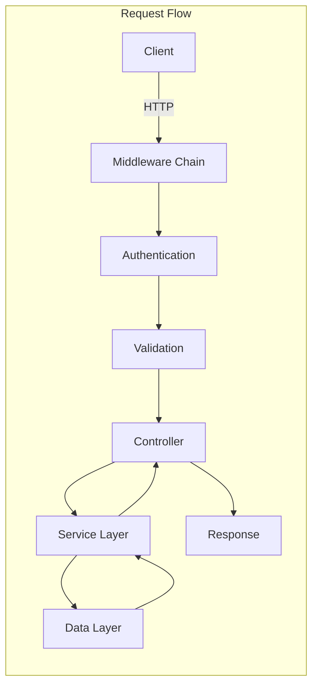
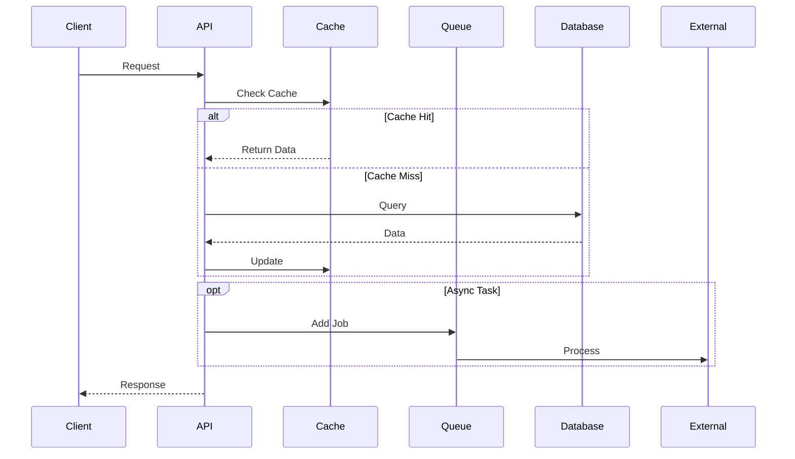

# {{PROJECT_NAME}} - Backend API Project Plan

*Generated: {{CREATED_DATE}}*
*Last Updated: {{LAST_UPDATED}}*

## Overview

**Project Name**: {{PROJECT_NAME}}

**Description**: {{DESCRIPTION}}

**Target Users**: {{TARGET_USERS}}

**Project Type**: Backend API

**Status**: {{STATUS}} ({{PROGRESS_PERCENT}}% complete)

---

## Problem Statement

**Current Pain Points:**
{{PAIN_POINTS}}

**Solution:**
{{SOLUTION}}

**Key Features:**
{{KEY_FEATURES}}

---

## Architecture

### System Overview

```mermaid
graph TB
    subgraph "API Gateway"
        A[Load Balancer]
        B[Rate Limiter]
    end

    subgraph "Application Layer"
        C[API Server<br/>{{BACKEND_FRAMEWORK}}]
        D[Authentication]
        E[Business Logic]
        F[Background Jobs]
    end

    subgraph "Data Layer"
        G[{{DATABASE}}]
        H[Cache<br/>Redis]
        I[Message Queue]
    end

    subgraph "External Services"
        J[Email Service]
        K[File Storage<br/>S3]
        L[Third-party APIs]
        M[Analytics]
    end

    A --> B
    B --> C
    C --> D
    C --> E
    E --> G
    E --> H
    F --> I
    F --> G
    C --> J
    C --> K
    C --> L
    C --> M
```

### API Architecture



### Data Flow



---

## Tech Stack

### Backend Framework
- **Framework**: {{BACKEND_FRAMEWORK}} (Express.js, NestJS, Fastify, Django, Flask, Spring Boot)
- **Language**: {{BACKEND_LANGUAGE}} (TypeScript, Python, Java, Go)
- **Runtime**: {{RUNTIME}} (Node.js, Python 3.x, JVM, Go)

### API & Communication
- **API Style**: {{API_STYLE}} (REST, GraphQL, gRPC, tRPC)
- **Documentation**: {{API_DOCS}} (Swagger/OpenAPI, GraphQL Playground)
- **Validation**: {{VALIDATION}} (Zod, Joi, Pydantic, class-validator)
- **Serialization**: JSON / Protocol Buffers

### Authentication & Security
- **Auth Method**: {{AUTH_METHOD}} (JWT, OAuth 2.0, API Keys, SAML)
- **Authorization**: {{AUTHORIZATION}} (RBAC, ABAC, Policy-based)
- **Encryption**: bcrypt for passwords, TLS/SSL for transport
- **Rate Limiting**: Redis-based rate limiting
- **CORS**: Configurable CORS middleware

### Database
- **Primary**: {{DATABASE}} (PostgreSQL, MySQL, MongoDB, Cassandra)
- **ORM/ODM**: {{ORM}} (Prisma, TypeORM, Sequelize, Mongoose, SQLAlchemy)
- **Migrations**: {{MIGRATION_TOOL}}
- **Cache**: Redis / Memcached
- **Search**: {{SEARCH_ENGINE}} (Elasticsearch, MeiliSearch - if needed)

### Background Jobs & Queues
- **Queue**: {{QUEUE}} (Bull, BullMQ, Celery, RabbitMQ, AWS SQS)
- **Scheduler**: {{SCHEDULER}} (node-cron, APScheduler, Quartz)
- **Workers**: Background worker processes

### DevOps & Infrastructure
- **Hosting**: {{HOSTING}} (AWS, GCP, Azure, DigitalOcean, Railway)
- **Containerization**: Docker + Docker Compose
- **Orchestration**: {{ORCHESTRATION}} (Kubernetes, Docker Swarm - if needed)
- **CI/CD**: GitHub Actions / GitLab CI / Jenkins
- **Monitoring**: {{MONITORING}} (Datadog, New Relic, Prometheus + Grafana)
- **Logging**: {{LOGGING}} (Winston, Pino, ELK Stack, CloudWatch)
- **Error Tracking**: Sentry / Rollbar

### Development Tools
- **Version Control**: Git + GitHub/GitLab
- **Package Manager**: {{PACKAGE_MANAGER}} (npm, yarn, pnpm, pip, maven)
- **Code Quality**: {{LINTER}} (ESLint, Pylint, Checkstyle) + Prettier
- **API Testing**: Postman / Insomnia / curl
- **Database Client**: {{DB_CLIENT}} (pgAdmin, MongoDB Compass, DataGrip)
- **Load Testing**: {{LOAD_TEST}} (k6, Apache JMeter, Locust)

### Testing
- **Unit Tests**: {{UNIT_TEST}} (Jest, Vitest, pytest, JUnit)
- **Integration Tests**: {{INTEGRATION_TEST}} (Supertest, TestContainers)
- **API Tests**: Postman Collections / Newman
- **Load Tests**: k6 / Artillery
- **Coverage**: {{COVERAGE_TOOL}} (Istanbul, Coverage.py)

---

## Project Structure

```
{{PROJECT_NAME}}/
├── src/
│   ├── controllers/          # Request handlers
│   │   ├── auth.controller.ts
│   │   ├── user.controller.ts
│   │   └── ...
│   │
│   ├── services/             # Business logic
│   │   ├── auth.service.ts
│   │   ├── user.service.ts
│   │   └── ...
│   │
│   ├── models/               # Data models
│   │   ├── user.model.ts
│   │   └── ...
│   │
│   ├── routes/               # API route definitions
│   │   ├── index.ts
│   │   ├── auth.routes.ts
│   │   └── ...
│   │
│   ├── middleware/           # Custom middleware
│   │   ├── auth.middleware.ts
│   │   ├── error.middleware.ts
│   │   ├── validation.middleware.ts
│   │   └── ...
│   │
│   ├── utils/                # Helper functions
│   │   ├── logger.ts
│   │   ├── validator.ts
│   │   └── ...
│   │
│   ├── config/               # Configuration
│   │   ├── database.ts
│   │   ├── redis.ts
│   │   └── ...
│   │
│   ├── jobs/                 # Background jobs
│   │   └── email.job.ts
│   │
│   ├── types/                # TypeScript types
│   │   └── index.ts
│   │
│   └── index.ts              # Entry point
│
├── tests/                    # Test files
│   ├── unit/
│   ├── integration/
│   └── e2e/
│
├── migrations/               # Database migrations
│   └── ...
│
├── scripts/                  # Utility scripts
│   ├── seed.ts
│   └── migrate.ts
│
├── docs/                     # API documentation
│   └── api.md
│
├── .env.example             # Environment variables template
├── .gitignore
├── docker-compose.yml       # Local development setup
├── Dockerfile
├── package.json
├── tsconfig.json
└── README.md
```

---

## Tasks & Implementation Plan

### Phase 1: Foundation (Est: {{PHASE1_ESTIMATE}})

#### T1.1: Project Setup
- [ ] **Status**: TODO
- **Complexity**: Low
- **Estimated**: 1.5 hours
- **Dependencies**: None
- **Description**:
  - Initialize {{BACKEND_FRAMEWORK}} project
  - Configure TypeScript/Language settings
  - Setup ESLint + Prettier
  - Create .env.example
  - Setup project structure
  - Initialize Git repository
  - Create basic README

#### T1.2: Database Configuration
- [ ] **Status**: TODO
- **Complexity**: Medium
- **Estimated**: 3 hours
- **Dependencies**: T1.1
- **Description**:
  - Setup {{DATABASE}} connection
  - Configure {{ORM}}
  - Create initial schema
  - Setup migration system
  - Create seed data scripts
  - Add database health check endpoint

#### T1.3: Core Middleware
- [ ] **Status**: TODO
- **Complexity**: Medium
- **Estimated**: 3 hours
- **Dependencies**: T1.1
- **Description**:
  - Request logging middleware
  - Error handling middleware
  - CORS configuration
  - Request validation middleware
  - Rate limiting middleware
  - Helmet.js security headers

#### T1.4: Authentication System
- [ ] **Status**: TODO
- **Complexity**: High
- **Estimated**: 6 hours
- **Dependencies**: T1.2
- **Description**:
  - Implement {{AUTH_METHOD}} authentication
  - Create User model
  - Password hashing (bcrypt)
  - Login/Register endpoints
  - Token generation/validation
  - Auth middleware
  - Refresh token mechanism
  - Password reset flow

---

### Phase 2: Core API (Est: {{PHASE2_ESTIMATE}})

{{CORE_API_TASKS}}

---

### Phase 3: Advanced Features (Est: {{PHASE3_ESTIMATE}})

#### T3.1: Caching Layer
- [ ] **Status**: TODO
- **Complexity**: Medium
- **Estimated**: 4 hours
- **Description**:
  - Setup Redis connection
  - Implement caching middleware
  - Cache frequently accessed data
  - Cache invalidation strategy
  - Add cache warming scripts

#### T3.2: Background Jobs
- [ ] **Status**: TODO
- **Complexity**: High
- **Estimated**: 6 hours
- **Description**:
  - Setup job queue ({{QUEUE}})
  - Create worker processes
  - Implement email jobs
  - Implement data processing jobs
  - Add job monitoring/retry logic
  - Create job scheduling system

#### T3.3: Search Functionality
- [ ] **Status**: TODO
- **Complexity**: High
- **Estimated**: 6 hours
- **Description**:
  - Setup {{SEARCH_ENGINE}}
  - Index important data
  - Implement search endpoints
  - Add filtering and pagination
  - Optimize search performance

#### T3.4: File Upload/Storage
- [ ] **Status**: TODO
- **Complexity**: Medium
- **Estimated**: 4 hours
- **Description**:
  - Setup file storage ({{STORAGE}})
  - Implement upload endpoint
  - Add file validation
  - Image processing (resize, optimize)
  - Generate signed URLs
  - Add file deletion endpoint

---

### Phase 4: Testing, Monitoring & Deployment (Est: {{PHASE4_ESTIMATE}})

#### T4.1: Testing Suite
- [ ] **Status**: TODO
- **Complexity**: High
- **Estimated**: 8 hours
- **Description**:
  - Write unit tests for services
  - Write integration tests for API endpoints
  - Add test fixtures and factories
  - Setup test database
  - Add coverage reporting
  - Create CI test pipeline

#### T4.2: Monitoring & Logging
- [ ] **Status**: TODO
- **Complexity**: Medium
- **Estimated**: 4 hours
- **Dependencies**: T4.1
- **Description**:
  - Setup structured logging
  - Add request/response logging
  - Implement error tracking (Sentry)
  - Add performance monitoring
  - Create health check endpoints
  - Setup alerting rules

#### T4.3: API Documentation
- [ ] **Status**: TODO
- **Complexity**: Low
- **Estimated**: 2 hours
- **Description**:
  - Generate OpenAPI/Swagger docs
  - Add endpoint descriptions
  - Include request/response examples
  - Add authentication documentation
  - Create Postman collection

#### T4.4: Deployment
- [ ] **Status**: TODO
- **Complexity**: High
- **Estimated**: 6 hours
- **Dependencies**: T4.1, T4.2, T4.3
- **Description**:
  - Create Dockerfile
  - Setup Docker Compose for production
  - Configure CI/CD pipeline
  - Setup environment variables
  - Configure SSL/TLS
  - Deploy to {{HOSTING}}
  - Setup database backups
  - Configure auto-scaling (if needed)

---

## Progress Tracking

### Overall Status
**Total Tasks**: {{TOTAL_TASKS}}
**Completed**: {{COMPLETED_TASKS}} {{PROGRESS_BAR}} ({{PROGRESS_PERCENT}}%)
**In Progress**: {{IN_PROGRESS_TASKS}}
**Blocked**: {{BLOCKED_TASKS}}

### Phase Progress
- Phase 1: Foundation → {{PHASE1_PROGRESS}}%
- Phase 2: Core API → {{PHASE2_PROGRESS}}%
- Phase 3: Advanced Features → {{PHASE3_PROGRESS}}%
- Phase 4: Testing & Deployment → {{PHASE4_PROGRESS}}%

### Current Focus
{{CURRENT_FOCUS}}

---

## API Endpoints

### Authentication
```
POST   /api/auth/register       - Register new user
POST   /api/auth/login          - Login user
POST   /api/auth/logout         - Logout user
POST   /api/auth/refresh        - Refresh access token
POST   /api/auth/forgot-password - Request password reset
POST   /api/auth/reset-password - Reset password
```

### {{MAIN_RESOURCE}}
```
{{API_ENDPOINTS}}
```

---

## Success Criteria

### Minimum Viable Product (MVP)
- Authentication and authorization working
- Core CRUD operations functional
- Input validation on all endpoints
- Error handling implemented
- API documentation complete
- Basic caching implemented
- Deployed to production

### Nice to Have (v1.1+)
{{NICE_TO_HAVE}}

---

## Technical Decisions & Notes

### Why {{BACKEND_FRAMEWORK}}?
{{BACKEND_REASONING}}

### Why {{DATABASE}}?
{{DATABASE_REASONING}}

### API Design Principles
{{API_PRINCIPLES}}

### Error Handling Strategy
{{ERROR_HANDLING}}

---

## Resources & References

### Documentation
- [{{BACKEND_FRAMEWORK}} Docs]({{BACKEND_DOCS_URL}})
- [{{DATABASE}} Docs]({{DATABASE_DOCS_URL}})
- [{{ORM}} Docs]({{ORM_DOCS_URL}})

### Tools & Libraries
{{TOOLS_LIBRARIES}}

---

## Performance Benchmarks

### Target Metrics
- **Response Time**: < 200ms for 95th percentile
- **Throughput**: {{TARGET_RPS}} requests/second
- **Availability**: 99.9% uptime
- **Error Rate**: < 0.1%

### Load Testing Results
{{LOAD_TEST_RESULTS}}

---

## Security Considerations

### Security Measures
- HTTPS only in production
- JWT token expiration (15 min access, 7 days refresh)
- Rate limiting (100 req/15min per IP)
- Input validation on all endpoints
- SQL injection prevention (parameterized queries)
- XSS prevention
- CSRF protection
- Helmet.js security headers

### Security Audit Checklist
{{SECURITY_CHECKLIST}}

---

## Risk Management

### Potential Risks
1. **Database Performance**: Slow queries with large datasets
   - **Mitigation**: Proper indexing, query optimization, caching
2. **API Downtime**: Service unavailability
   - **Mitigation**: Load balancing, auto-scaling, health checks
3. **Data Loss**: Database failures
   - **Mitigation**: Regular backups, replication, point-in-time recovery

{{ADDITIONAL_RISKS}}

---

## Future Enhancements

{{FUTURE_ENHANCEMENTS}}

---

*Generated by plan-plugin v{{PLUGIN_VERSION}}*
