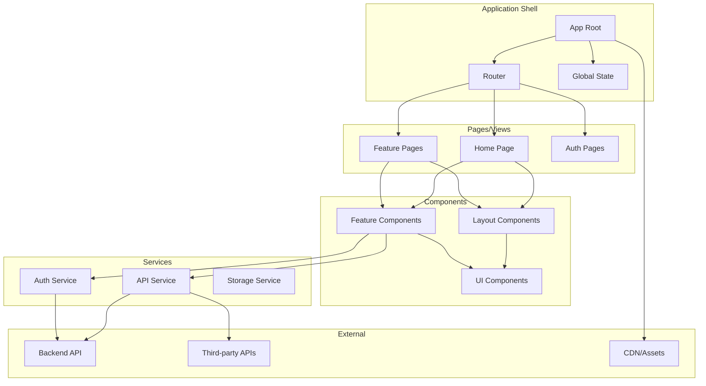
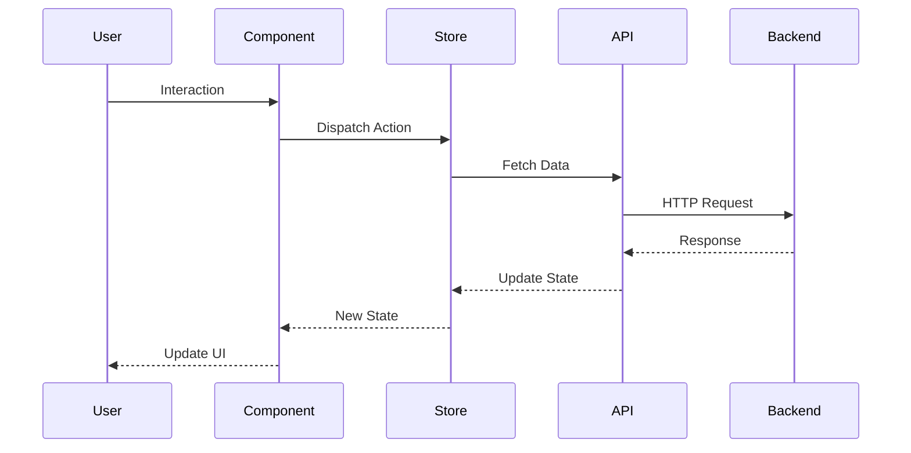
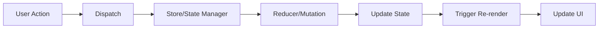
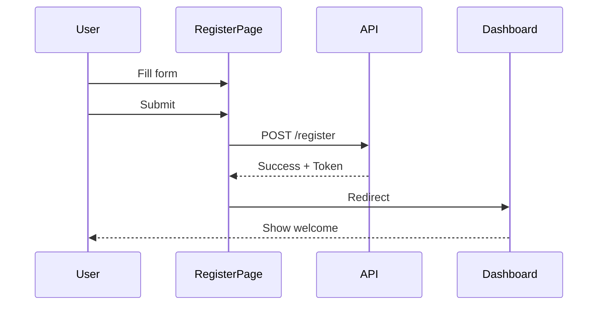

# {{PROJECT_NAME}} - Frontend SPA Project Plan

*Generated: {{CREATED_DATE}}*
*Last Updated: {{LAST_UPDATED}}*

## Overview

**Project Name**: {{PROJECT_NAME}}

**Description**: {{DESCRIPTION}}

**Target Users**: {{TARGET_USERS}}

**Project Type**: Frontend Single Page Application

**Status**: {{STATUS}} ({{PROGRESS_PERCENT}}% complete)

---

## Problem Statement

**Current Pain Points:**
{{PAIN_POINTS}}

**Solution:**
{{SOLUTION}}

**Key Features:**
{{KEY_FEATURES}}

---

## Architecture

### Component Architecture



### Data Flow



### State Management



---

## Tech Stack

### Core Framework
- **Framework**: {{FRONTEND_FRAMEWORK}} (React, Vue, Angular, Svelte, Solid)
- **Language**: TypeScript
- **Build Tool**: {{BUILD_TOOL}} (Vite, Webpack, Turbopack, esbuild)
- **Package Manager**: {{PACKAGE_MANAGER}} (npm, yarn, pnpm, bun)

### State Management
- **Solution**: {{STATE_MANAGEMENT}} (Redux Toolkit, Zustand, Pinia, Vuex, NgRx, Jotai)
- **Server State**: {{SERVER_STATE}} (TanStack Query, SWR, Apollo Client, RTK Query)
- **Form State**: React Hook Form / Formik / Vee-Validate

### Styling & UI
- **CSS Solution**: {{STYLING}} (Tailwind CSS, CSS Modules, Styled Components, Emotion, Sass)
- **UI Library**: {{UI_LIBRARY}} (Shadcn/ui, Material-UI, Chakra UI, Ant Design, Vuetify)
- **Icons**: {{ICONS}} (Lucide, Heroicons, Font Awesome, Material Icons)
- **Animations**: {{ANIMATIONS}} (Framer Motion, GSAP, CSS Animations, Transition.js)

### Routing
- **Router**: {{ROUTER}} (React Router, Vue Router, Angular Router, TanStack Router)
- **Route Protection**: Auth guards/middleware
- **Code Splitting**: Dynamic imports for routes

### Data Fetching
- **HTTP Client**: {{HTTP_CLIENT}} (Axios, Fetch API, ky)
- **WebSockets**: {{WEBSOCKET}} (Socket.io-client, native WebSocket)
- **GraphQL**: {{GRAPHQL}} (Apollo Client, URQL, Relay - if needed)

### Development Tools
- **Version Control**: Git + GitHub
- **Code Quality**: ESLint + Prettier
- **Type Checking**: TypeScript strict mode
- **Dev Server**: {{DEV_SERVER}} (Vite dev server, Webpack dev server)
- **API Mocking**: {{MOCKING}} (MSW, Mirage JS, JSON Server)

### Testing
- **Unit Tests**: {{UNIT_TEST}} (Vitest, Jest)
- **Component Tests**: {{COMPONENT_TEST}} (Testing Library, Vitest, Vue Test Utils)
- **E2E Tests**: {{E2E_TEST}} (Playwright, Cypress, WebdriverIO)
- **Visual Regression**: {{VISUAL_TEST}} (Chromatic, Percy - optional)

### Build & Deployment
- **Hosting**: {{HOSTING}} (Vercel, Netlify, Cloudflare Pages, AWS S3)
- **CI/CD**: GitHub Actions / GitLab CI
- **Environment**: .env files for config
- **PWA**: {{PWA}} (Workbox, vite-plugin-pwa - if needed)

### Performance & Monitoring
- **Analytics**: {{ANALYTICS}} (Google Analytics, Mixpanel, PostHog, Plausible)
- **Error Tracking**: {{ERROR_TRACKING}} (Sentry, LogRocket, Rollbar)
- **Performance**: {{PERFORMANCE}} (Web Vitals, Lighthouse CI)
- **Bundle Analysis**: {{BUNDLE_ANALYZER}} (Vite Bundle Visualizer, webpack-bundle-analyzer)

---

## Project Structure

```
{{PROJECT_NAME}}/
├── public/                   # Static assets
│   ├── favicon.ico
│   └── robots.txt
│
├── src/
│   ├── components/          # Reusable components
│   │   ├── ui/             # Basic UI components
│   │   │   ├── Button/
│   │   │   ├── Input/
│   │   │   └── ...
│   │   ├── layout/         # Layout components
│   │   │   ├── Header/
│   │   │   ├── Sidebar/
│   │   │   └── Footer/
│   │   └── features/       # Feature-specific components
│   │       └── ...
│   │
│   ├── pages/              # Page components
│   │   ├── Home/
│   │   ├── About/
│   │   ├── Dashboard/
│   │   └── ...
│   │
│   ├── hooks/              # Custom React hooks
│   │   ├── useAuth.ts
│   │   ├── useAPI.ts
│   │   └── ...
│   │
│   ├── store/              # State management
│   │   ├── index.ts
│   │   ├── slices/
│   │   └── hooks.ts
│   │
│   ├── services/           # API service layer
│   │   ├── api.ts
│   │   ├── auth.service.ts
│   │   └── ...
│   │
│   ├── utils/              # Helper functions
│   │   ├── validators.ts
│   │   ├── formatters.ts
│   │   └── ...
│   │
│   ├── types/              # TypeScript types
│   │   ├── models.ts
│   │   └── api.ts
│   │
│   ├── constants/          # App constants
│   │   └── index.ts
│   │
│   ├── assets/             # Images, fonts, etc.
│   │   ├── images/
│   │   └── fonts/
│   │
│   ├── styles/             # Global styles
│   │   ├── index.css
│   │   └── variables.css
│   │
│   ├── routes/             # Route configuration
│   │   └── index.tsx
│   │
│   ├── App.tsx             # Root component
│   ├── main.tsx            # Entry point
│   └── vite-env.d.ts
│
├── tests/                  # Test files
│   ├── unit/
│   ├── integration/
│   └── e2e/
│
├── .env.example           # Environment variables template
├── .eslintrc.json
├── .prettierrc
├── .gitignore
├── index.html
├── package.json
├── tsconfig.json
├── vite.config.ts
└── README.md
```

---

## Tasks & Implementation Plan

### Phase 1: Foundation (Est: {{PHASE1_ESTIMATE}})

#### T1.1: Project Setup
- [ ] **Status**: TODO
- **Complexity**: Low
- **Estimated**: 1.5 hours
- **Dependencies**: None
- **Description**:
  - Initialize {{FRONTEND_FRAMEWORK}} project with {{BUILD_TOOL}}
  - Configure TypeScript (strict mode)
  - Setup ESLint + Prettier
  - Configure path aliases (@components, @utils, etc.)
  - Create .env.example
  - Initialize Git repository
  - Create basic project structure

#### T1.2: Routing Setup
- [ ] **Status**: TODO
- **Complexity**: Low
- **Estimated**: 2 hours
- **Dependencies**: T1.1
- **Description**:
  - Setup {{ROUTER}}
  - Create route configuration
  - Implement layout components
  - Add 404 page
  - Setup route guards for auth
  - Add loading states for routes

#### T1.3: Styling System
- [ ] **Status**: TODO
- **Complexity**: Medium
- **Estimated**: 3 hours
- **Dependencies**: T1.1
- **Description**:
  - Setup {{STYLING}} (Tailwind CSS / Styled Components)
  - Configure theme (colors, fonts, spacing)
  - Create global styles
  - Setup responsive breakpoints
  - Add dark mode support (optional)
  - Create base UI components (Button, Input, Card, etc.)

#### T1.4: API Integration Setup
- [ ] **Status**: TODO
- **Complexity**: Medium
- **Estimated**: 3 hours
- **Dependencies**: T1.1
- **Description**:
  - Setup {{HTTP_CLIENT}} (Axios / Fetch wrapper)
  - Create API service base
  - Add request/response interceptors
  - Implement error handling
  - Setup {{SERVER_STATE}} (TanStack Query / SWR)
  - Add loading and error states
  - Configure base URL from env

---

### Phase 2: Authentication & State (Est: {{PHASE2_ESTIMATE}})

#### T2.1: State Management
- [ ] **Status**: TODO
- **Complexity**: Medium
- **Estimated**: 4 hours
- **Dependencies**: T1.1
- **Description**:
  - Setup {{STATE_MANAGEMENT}} store
  - Create store slices/modules
  - Add typed hooks for store access
  - Implement store persistence (if needed)
  - Add DevTools integration
  - Create selectors

#### T2.2: Authentication System
- [ ] **Status**: TODO
- **Complexity**: High
- **Estimated**: 6 hours
- **Dependencies**: T1.4, T2.1
- **Description**:
  - Create login/register pages
  - Implement auth service
  - Add token storage (localStorage/cookies)
  - Create auth context/store
  - Implement protected routes
  - Add logout functionality
  - Handle token refresh
  - Add "Remember me" feature

#### T2.3: User Profile & Settings
- [ ] **Status**: TODO
- **Complexity**: Medium
- **Estimated**: 4 hours
- **Dependencies**: T2.2
- **Description**:
  - Create profile page
  - Implement profile editing
  - Add avatar upload
  - Create settings page
  - Add password change functionality
  - Implement account deletion

---

### Phase 3: Core Features (Est: {{PHASE3_ESTIMATE}})

{{CORE_FEATURES_TASKS}}

---

### Phase 4: Polish & Optimization (Est: {{PHASE4_ESTIMATE}})

#### T4.1: Performance Optimization
- [ ] **Status**: TODO
- **Complexity**: Medium
- **Estimated**: 4 hours
- **Description**:
  - Implement code splitting for routes
  - Add lazy loading for components
  - Optimize images (WebP, lazy loading)
  - Implement virtual scrolling (if needed)
  - Add bundle size analysis
  - Optimize re-renders
  - Add React.memo / useMemo where needed

#### T4.2: Accessibility (a11y)
- [ ] **Status**: TODO
- **Complexity**: Medium
- **Estimated**: 3 hours
- **Description**:
  - Add ARIA labels
  - Ensure keyboard navigation
  - Add focus management
  - Test with screen readers
  - Ensure proper color contrast
  - Add skip links
  - Run Lighthouse accessibility audit

#### T4.3: Error Handling & Loading States
- [ ] **Status**: TODO
- **Complexity**: Medium
- **Estimated**: 3 hours
- **Description**:
  - Create error boundary components
  - Add global error handler
  - Create consistent loading states
  - Add skeleton screens
  - Implement retry logic
  - Create offline detection
  - Add toast/notification system

#### T4.4: Testing Suite
- [ ] **Status**: TODO
- **Complexity**: High
- **Estimated**: 8 hours
- **Description**:
  - Write unit tests for utils/services
  - Write component tests
  - Add E2E tests for critical flows
  - Setup test coverage reporting
  - Mock API responses
  - Test accessibility
  - Add visual regression tests (optional)

#### T4.5: Documentation & Deployment
- [ ] **Status**: TODO
- **Complexity**: Low
- **Estimated**: 2 hours
- **Dependencies**: T4.4
- **Description**:
  - Write comprehensive README
  - Add component documentation
  - Create deployment guide
  - Setup CI/CD pipeline
  - Configure environment variables
  - Deploy to {{HOSTING}}
  - Setup analytics
  - Setup error tracking

---

## Progress Tracking

### Overall Status
**Total Tasks**: {{TOTAL_TASKS}}
**Completed**: {{COMPLETED_TASKS}} {{PROGRESS_BAR}} ({{PROGRESS_PERCENT}}%)
**In Progress**: {{IN_PROGRESS_TASKS}}
**Blocked**: {{BLOCKED_TASKS}}

### Phase Progress
- Phase 1: Foundation → {{PHASE1_PROGRESS}}%
- Phase 2: Authentication & State → {{PHASE2_PROGRESS}}%
- Phase 3: Core Features → {{PHASE3_PROGRESS}}%
- Phase 4: Polish & Optimization → {{PHASE4_PROGRESS}}%

### Current Focus
{{CURRENT_FOCUS}}

---

## Design System

### Color Palette
```css
{{COLOR_PALETTE}}
```

### Typography
```css
{{TYPOGRAPHY}}
```

### Spacing Scale
```css
{{SPACING}}
```

### Component Variants
{{COMPONENT_VARIANTS}}

---

## Key User Flows

### User Registration Flow


### {{MAIN_FEATURE}} Flow
{{MAIN_FEATURE_FLOW}}

---

## Success Criteria

### Minimum Viable Product (MVP)
- Responsive design (mobile, tablet, desktop)
- User authentication working
- Core features functional
- Proper error handling
- Loading states implemented
- Deployed to production
- Basic analytics working

### Nice to Have (v1.1+)
{{NICE_TO_HAVE}}

---

## Technical Decisions & Notes

### Why {{FRONTEND_FRAMEWORK}}?
{{FRONTEND_REASONING}}

### Why {{STATE_MANAGEMENT}}?
{{STATE_REASONING}}

### Why {{STYLING}}?
{{STYLING_REASONING}}

### Component Design Principles
{{COMPONENT_PRINCIPLES}}

---

## Resources & References

### Documentation
- [{{FRONTEND_FRAMEWORK}} Docs]({{FRAMEWORK_DOCS_URL}})
- [{{UI_LIBRARY}} Docs]({{UI_DOCS_URL}})
- [{{STATE_MANAGEMENT}} Docs]({{STATE_DOCS_URL}})

### Design Resources
{{DESIGN_RESOURCES}}

### Tools & Libraries
{{TOOLS_LIBRARIES}}

---

## Performance Benchmarks

### Target Metrics
- **First Contentful Paint**: < 1.5s
- **Time to Interactive**: < 3.5s
- **Largest Contentful Paint**: < 2.5s
- **Cumulative Layout Shift**: < 0.1
- **First Input Delay**: < 100ms
- **Lighthouse Score**: > 90

### Bundle Size Goals
- **Initial Bundle**: < 200KB gzipped
- **Total JS**: < 500KB gzipped
- **Total CSS**: < 50KB gzipped

---

## Browser Support

### Target Browsers
- Chrome (last 2 versions)
- Firefox (last 2 versions)
- Safari (last 2 versions)
- Edge (last 2 versions)
- {{ADDITIONAL_BROWSERS}}

### Mobile Support
- iOS Safari (last 2 versions)
- Chrome Mobile (last 2 versions)

---

## Risk Management

### Potential Risks
1. **Performance**: Large bundle size affects load time
   - **Mitigation**: Code splitting, lazy loading, bundle analysis
2. **Browser Compatibility**: Features not supported in older browsers
   - **Mitigation**: Polyfills, progressive enhancement, graceful degradation
3. **Security**: XSS vulnerabilities
   - **Mitigation**: Sanitize user input, use framework security features, CSP headers

{{ADDITIONAL_RISKS}}

---

## Future Enhancements

{{FUTURE_ENHANCEMENTS}}

---

*Generated by plan-plugin v{{PLUGIN_VERSION}}*
