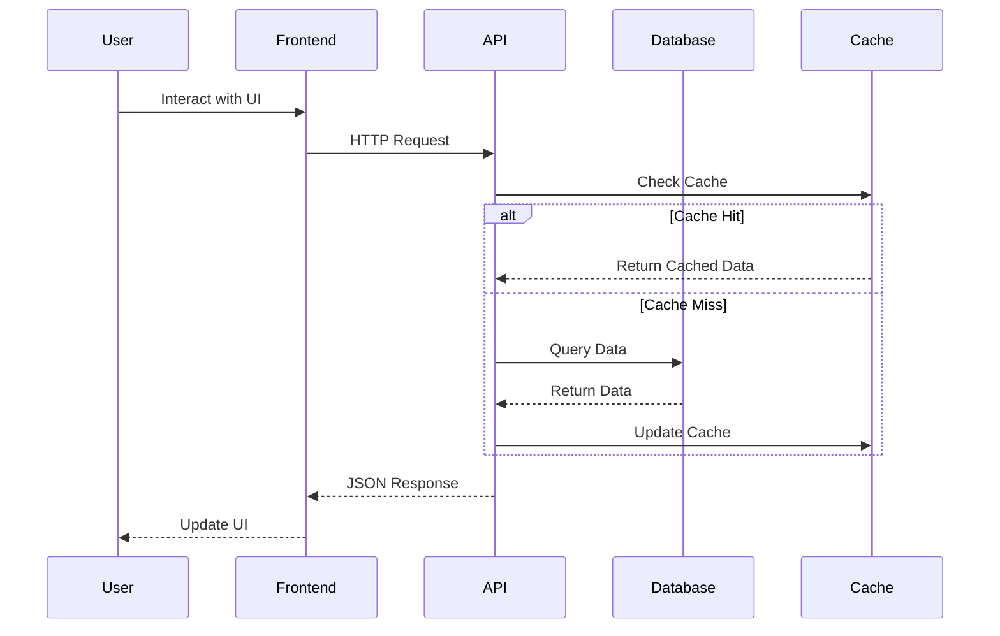

# {{PROJECT_NAME}} - Full-Stack Project Plan

*Generated: {{CREATED_DATE}}*
*Last Updated: {{LAST_UPDATED}}*

## Overview

**Project Name**: {{PROJECT_NAME}}

**Description**: {{DESCRIPTION}}

**Target Users**: {{TARGET_USERS}}

**Project Type**: Full-Stack Web Application

**Status**: {{STATUS}} ({{PROGRESS_PERCENT}}% complete)

---

## Problem Statement

**Current Pain Points:**
{{PAIN_POINTS}}

**Solution:**
{{SOLUTION}}

**Key Features:**
{{KEY_FEATURES}}

---

## Architecture

### System Overview

```mermaid
graph TB
    subgraph "Client Layer"
        A[Web Browser]
        B[Mobile Browser]
    end

    subgraph "Frontend"
        C[{{FRONTEND_FRAMEWORK}}]
        D[State Management]
        E[UI Components]
    end

    subgraph "Backend"
        F[API Server<br/>{{BACKEND_FRAMEWORK}}]
        G[Authentication]
        H[Business Logic]
    end

    subgraph "Data Layer"
        I[{{DATABASE}}]
        J[Cache<br/>Redis]
        K[File Storage]
    end

    subgraph "External Services"
        L[Email Service]
        M[Payment Gateway]
        N[Third-party APIs]
    end

    A --> C
    B --> C
    C --> D
    C --> E
    E --> F
    F --> G
    F --> H
    H --> I
    H --> J
    F --> K
    F --> L
    F --> M
    F --> N
```

### Data Flow



---

## Tech Stack

### Frontend
- **Framework**: {{FRONTEND_FRAMEWORK}} (React, Vue, Angular, Svelte)
- **Language**: TypeScript
- **State Management**: {{STATE_MANAGEMENT}} (Redux, Zustand, Pinia, etc.)
- **Styling**: {{STYLING}} (Tailwind CSS, Styled Components, CSS Modules)
- **Build Tool**: Vite / Webpack
- **UI Library**: {{UI_LIBRARY}} (Shadcn, MUI, Chakra UI, etc.)
- **Forms**: React Hook Form / Formik
- **Data Fetching**: TanStack Query / SWR / Apollo Client

### Backend
- **Framework**: {{BACKEND_FRAMEWORK}} (Express.js, NestJS, Fastify, Django, Flask)
- **Language**: {{BACKEND_LANGUAGE}} (TypeScript, Python, Go)
- **Authentication**: JWT + OAuth 2.0
- **Validation**: Zod / Joi / Pydantic
- **ORM**: {{ORM}} (Prisma, TypeORM, Sequelize, SQLAlchemy)
- **API Style**: REST / GraphQL / tRPC

### Database
- **Primary**: {{DATABASE}} (PostgreSQL, MySQL, MongoDB)
- **Cache**: Redis
- **Search**: {{SEARCH_ENGINE}} (Elasticsearch, Algolia - if needed)
- **File Storage**: {{STORAGE}} (AWS S3, Cloudinary, Local)

### DevOps & Infrastructure
- **Hosting**: {{HOSTING}} (Vercel, AWS, DigitalOcean, Railway)
- **CI/CD**: GitHub Actions / GitLab CI
- **Containerization**: Docker + Docker Compose
- **Monitoring**: {{MONITORING}} (Sentry, LogRocket, Datadog)
- **Analytics**: {{ANALYTICS}} (Google Analytics, Mixpanel, PostHog)

### Development Tools
- **Version Control**: Git + GitHub
- **Package Manager**: {{PACKAGE_MANAGER}} (npm, yarn, pnpm)
- **Code Quality**: ESLint + Prettier
- **API Testing**: Postman / Insomnia / Thunder Client
- **Database Client**: {{DB_CLIENT}} (pgAdmin, MongoDB Compass, DataGrip)

### Testing
- **Unit Tests**: {{UNIT_TEST}} (Vitest, Jest, pytest)
- **Integration Tests**: Supertest / TestContainers
- **E2E Tests**: {{E2E_TEST}} (Playwright, Cypress)
- **API Testing**: Postman Collections / Newman

---

## Project Structure

```
{{PROJECT_NAME}}/
├── frontend/                  # Frontend application
│   ├── src/
│   │   ├── components/       # Reusable UI components
│   │   ├── pages/            # Page components
│   │   ├── hooks/            # Custom React hooks
│   │   ├── store/            # State management
│   │   ├── services/         # API service layer
│   │   ├── utils/            # Helper functions
│   │   ├── types/            # TypeScript types
│   │   ├── assets/           # Static assets
│   │   └── App.tsx           # Root component
│   ├── public/               # Public assets
│   ├── package.json
│   └── vite.config.ts
│
├── backend/                   # Backend application
│   ├── src/
│   │   ├── controllers/      # Request handlers
│   │   ├── services/         # Business logic
│   │   ├── models/           # Data models
│   │   ├── routes/           # API routes
│   │   ├── middleware/       # Custom middleware
│   │   ├── utils/            # Helper functions
│   │   ├── config/           # Configuration
│   │   └── index.ts          # Entry point
│   ├── tests/                # Test files
│   ├── package.json
│   └── tsconfig.json
│
├── shared/                    # Shared code (types, constants)
│   └── types.ts
│
├── docker-compose.yml         # Local development setup
├── .env.example              # Environment variables template
├── .gitignore
└── README.md
```

---

## Tasks & Implementation Plan

### Phase 1: Foundation (Est: {{PHASE1_ESTIMATE}})

#### T1.1: Project Setup
- [ ] **Status**: TODO
- **Complexity**: Low
- **Estimated**: 2 hours
- **Dependencies**: None
- **Description**:
  - Initialize frontend project ({{FRONTEND_FRAMEWORK}})
  - Initialize backend project ({{BACKEND_FRAMEWORK}})
  - Setup monorepo structure (if applicable)
  - Configure TypeScript
  - Setup ESLint + Prettier
  - Create .env.example files
  - Initialize Git repository

#### T1.2: Database Setup
- [ ] **Status**: TODO
- **Complexity**: Low
- **Estimated**: 2 hours
- **Dependencies**: T1.1
- **Description**:
  - Setup {{DATABASE}} database
  - Configure ORM ({{ORM}})
  - Create initial schema/models
  - Setup migrations
  - Create seed data scripts
  - Configure Redis for caching

#### T1.3: Authentication System
- [ ] **Status**: TODO
- **Complexity**: High
- **Estimated**: 6 hours
- **Dependencies**: T1.2
- **Description**:
  - Implement JWT authentication
  - Create User model
  - Setup password hashing
  - Implement login/register endpoints
  - Create auth middleware
  - Add OAuth providers (Google, GitHub)
  - Frontend login/register forms
  - Protected route handling

#### T1.4: Basic API Structure
- [ ] **Status**: TODO
- **Complexity**: Medium
- **Estimated**: 4 hours
- **Dependencies**: T1.2
- **Description**:
  - Setup Express router structure
  - Create base CRUD endpoints
  - Add request validation
  - Implement error handling
  - Add API documentation (Swagger/OpenAPI)
  - Setup CORS configuration

---

### Phase 2: Core Features (Est: {{PHASE2_ESTIMATE}})

{{CORE_FEATURES_TASKS}}

---

### Phase 3: Advanced Features (Est: {{PHASE3_ESTIMATE}})

{{ADVANCED_FEATURES_TASKS}}

---

### Phase 4: Testing & Deployment (Est: {{PHASE4_ESTIMATE}})

#### T4.1: Testing Suite
- [ ] **Status**: TODO
- **Complexity**: High
- **Estimated**: 8 hours
- **Description**:
  - Write unit tests for services
  - Write integration tests for API
  - Write E2E tests for critical flows
  - Setup test coverage reporting
  - Add tests to CI/CD pipeline

#### T4.2: Deployment Setup
- [ ] **Status**: TODO
- **Complexity**: Medium
- **Estimated**: 4 hours
- **Dependencies**: T4.1
- **Description**:
  - Configure production environment
  - Setup Docker containers
  - Configure CI/CD pipeline
  - Setup database backups
  - Configure monitoring and logging
  - Add error tracking (Sentry)
  - Deploy to {{HOSTING}}

#### T4.3: Documentation & Polish
- [ ] **Status**: TODO
- **Complexity**: Medium
- **Estimated**: 3 hours
- **Dependencies**: T4.2
- **Description**:
  - Write comprehensive README
  - Add API documentation
  - Create deployment guide
  - Add contributing guidelines
  - Write user documentation
  - Record demo video

---

## Progress Tracking

### Overall Status
**Total Tasks**: {{TOTAL_TASKS}}
**Completed**: {{COMPLETED_TASKS}} {{PROGRESS_BAR}} ({{PROGRESS_PERCENT}}%)
**In Progress**: {{IN_PROGRESS_TASKS}}
**Blocked**: {{BLOCKED_TASKS}}

### Phase Progress
- Phase 1: Foundation → {{PHASE1_PROGRESS}}%
- Phase 2: Core Features → {{PHASE2_PROGRESS}}%
- Phase 3: Advanced Features → {{PHASE3_PROGRESS}}%
- Phase 4: Testing & Deployment → {{PHASE4_PROGRESS}}%

### Current Focus
{{CURRENT_FOCUS}}

---

## Success Criteria

### Minimum Viable Product (MVP)
- User authentication and authorization working
- Core CRUD operations functional
- Responsive UI on desktop and mobile
- Basic error handling and validation
- Deployed to production environment

### Nice to Have (v1.1+)
{{NICE_TO_HAVE}}

---

## Technical Decisions & Notes

### Why {{FRONTEND_FRAMEWORK}}?
{{FRONTEND_REASONING}}

### Why {{BACKEND_FRAMEWORK}}?
{{BACKEND_REASONING}}

### Why {{DATABASE}}?
{{DATABASE_REASONING}}

### API Design Decisions
{{API_DECISIONS}}

---

## Resources & References

### Documentation
- [{{FRONTEND_FRAMEWORK}} Docs]({{FRONTEND_DOCS_URL}})
- [{{BACKEND_FRAMEWORK}} Docs]({{BACKEND_DOCS_URL}})
- [{{DATABASE}} Docs]({{DATABASE_DOCS_URL}})

### Tools & Libraries
{{TOOLS_LIBRARIES}}

---

## Risk Management

### Potential Risks
1. **Performance**: Database queries might be slow with large datasets
   - **Mitigation**: Add database indexes, implement caching, use pagination
2. **Security**: Authentication vulnerabilities
   - **Mitigation**: Use established libraries, implement rate limiting, regular security audits
3. **Scalability**: App might not scale with traffic
   - **Mitigation**: Design with horizontal scaling in mind, use load balancing

{{ADDITIONAL_RISKS}}

---

## Future Enhancements

{{FUTURE_ENHANCEMENTS}}

---

*Generated by plan-plugin v{{PLUGIN_VERSION}}*
