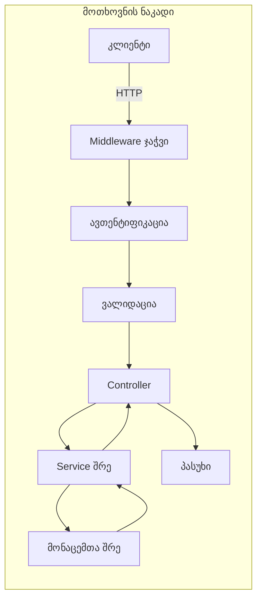
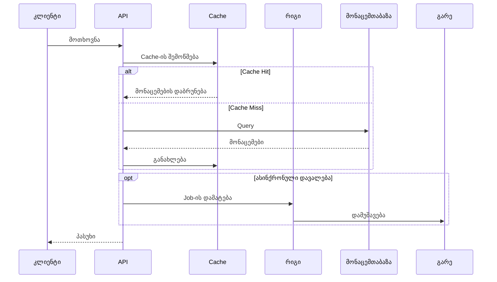

# {{PROJECT_NAME}} - Backend API პროექტის გეგმა

*შექმნილია: {{CREATED_DATE}}*
*ბოლოს განახლებული: {{LAST_UPDATED}}*

## მიმოხილვა

**პროექტის სახელი**: {{PROJECT_NAME}}

**აღწერა**: {{DESCRIPTION}}

**სამიზნე მომხმარებლები**: {{TARGET_USERS}}

**პროექტის ტიპი**: Backend API

**სტატუსი**: {{STATUS}} ({{PROGRESS_PERCENT}}% დასრულებული)

---

## პრობლემის განცხადება

**მიმდინარე პრობლემები:**
{{PAIN_POINTS}}

**გადაწყვეტა:**
{{SOLUTION}}

**მთავარი ფუნქციები:**
{{KEY_FEATURES}}

---

## არქიტექტურა

### სისტემის მიმოხილვა

```mermaid
graph TB
    subgraph "API Gateway"
        A[Load Balancer]
        B[Rate Limiter]
    end

    subgraph "აპლიკაციის შრე"
        C[API სერვერი<br/>{{BACKEND_FRAMEWORK}}]
        D[ავთენტიფიკაცია]
        E[ბიზნეს ლოგიკა]
        F[ფონური დავალებები]
    end

    subgraph "მონაცემთა შრე"
        G[{{DATABASE}}]
        H[Cache<br/>Redis]
        I[შეტყობინებების რიგი]
    end

    subgraph "გარე სერვისები"
        J[Email სერვისი]
        K[ფაილების საცავი<br/>S3]
        L[მესამე მხარის API-ები]
        M[ანალიტიკა]
    end

    A --> B
    B --> C
    C --> D
    C --> E
    E --> G
    E --> H
    F --> I
    F --> G
    C --> J
    C --> K
    C --> L
    C --> M
```

### API არქიტექტურა



### მონაცემთა ნაკადი



---

## ტექნოლოგიური სტეკი

### Backend Framework
- **Framework**: {{BACKEND_FRAMEWORK}} (Express.js, NestJS, Fastify, Django, Flask, Spring Boot)
- **ენა**: {{BACKEND_LANGUAGE}} (TypeScript, Python, Java, Go)
- **Runtime**: {{RUNTIME}} (Node.js, Python 3.x, JVM, Go)

### API და კომუნიკაცია
- **API სტილი**: {{API_STYLE}} (REST, GraphQL, gRPC, tRPC)
- **დოკუმენტაცია**: {{API_DOCS}} (Swagger/OpenAPI, GraphQL Playground)
- **ვალიდაცია**: {{VALIDATION}} (Zod, Joi, Pydantic, class-validator)
- **სერიალიზაცია**: JSON / Protocol Buffers

### ავთენტიფიკაცია და უსაფრთხოება
- **Auth მეთოდი**: {{AUTH_METHOD}} (JWT, OAuth 2.0, API Keys, SAML)
- **ავტორიზაცია**: {{AUTHORIZATION}} (RBAC, ABAC, Policy-based)
- **დაშიფვრა**: bcrypt პაროლებისთვის, TLS/SSL ტრანსპორტისთვის
- **Rate Limiting**: Redis-ზე დაფუძნებული rate limiting
- **CORS**: კონფიგურირებადი CORS middleware

### მონაცემთა ბაზა
- **ძირითადი**: {{DATABASE}} (PostgreSQL, MySQL, MongoDB, Cassandra)
- **ORM/ODM**: {{ORM}} (Prisma, TypeORM, Sequelize, Mongoose, SQLAlchemy)
- **Migration-ები**: {{MIGRATION_TOOL}}
- **Cache**: Redis / Memcached
- **ძებნა**: {{SEARCH_ENGINE}} (Elasticsearch, MeiliSearch - საჭიროების შემთხვევაში)

### ფონური დავალებები და რიგები
- **რიგი**: {{QUEUE}} (Bull, BullMQ, Celery, RabbitMQ, AWS SQS)
- **Scheduler**: {{SCHEDULER}} (node-cron, APScheduler, Quartz)
- **Worker-ები**: ფონური worker პროცესები

### DevOps და ინფრასტრუქტურა
- **ჰოსტინგი**: {{HOSTING}} (AWS, GCP, Azure, DigitalOcean, Railway)
- **კონტეინერიზაცია**: Docker + Docker Compose
- **Orchestration**: {{ORCHESTRATION}} (Kubernetes, Docker Swarm - საჭიროების შემთხვევაში)
- **CI/CD**: GitHub Actions / GitLab CI / Jenkins
- **მონიტორინგი**: {{MONITORING}} (Datadog, New Relic, Prometheus + Grafana)
- **ლოგირება**: {{LOGGING}} (Winston, Pino, ELK Stack, CloudWatch)
- **Error Tracking**: Sentry / Rollbar

### შემუშავების ხელსაწყოები
- **Version Control**: Git + GitHub/GitLab
- **Package Manager**: {{PACKAGE_MANAGER}} (npm, yarn, pnpm, pip, maven)
- **კოდის ხარისხი**: {{LINTER}} (ESLint, Pylint, Checkstyle) + Prettier
- **API Testing**: Postman / Insomnia / curl
- **მონაცემთა ბაზის კლიენტი**: {{DB_CLIENT}} (pgAdmin, MongoDB Compass, DataGrip)
- **Load Testing**: {{LOAD_TEST}} (k6, Apache JMeter, Locust)

### ტესტირება
- **Unit Tests**: {{UNIT_TEST}} (Jest, Vitest, pytest, JUnit)
- **Integration Tests**: {{INTEGRATION_TEST}} (Supertest, TestContainers)
- **API Tests**: Postman Collections / Newman
- **Load Tests**: k6 / Artillery
- **Coverage**: {{COVERAGE_TOOL}} (Istanbul, Coverage.py)

---

## პროექტის სტრუქტურა

```
{{PROJECT_NAME}}/
├── src/
│   ├── controllers/          # Request handlers
│   │   ├── auth.controller.ts
│   │   ├── user.controller.ts
│   │   └── ...
│   │
│   ├── services/             # ბიზნეს ლოგიკა
│   │   ├── auth.service.ts
│   │   ├── user.service.ts
│   │   └── ...
│   │
│   ├── models/               # მონაცემთა მოდელები
│   │   ├── user.model.ts
│   │   └── ...
│   │
│   ├── routes/               # API route განსაზღვრებები
│   │   ├── index.ts
│   │   ├── auth.routes.ts
│   │   └── ...
│   │
│   ├── middleware/           # Custom middleware
│   │   ├── auth.middleware.ts
│   │   ├── error.middleware.ts
│   │   ├── validation.middleware.ts
│   │   └── ...
│   │
│   ├── utils/                # დამხმარე ფუნქციები
│   │   ├── logger.ts
│   │   ├── validator.ts
│   │   └── ...
│   │
│   ├── config/               # კონფიგურაცია
│   │   ├── database.ts
│   │   ├── redis.ts
│   │   └── ...
│   │
│   ├── jobs/                 # ფონური დავალებები
│   │   └── email.job.ts
│   │
│   ├── types/                # TypeScript ტიპები
│   │   └── index.ts
│   │
│   └── index.ts              # შესასვლელი წერტილი
│
├── tests/                    # ტესტის ფაილები
│   ├── unit/
│   ├── integration/
│   └── e2e/
│
├── migrations/               # მონაცემთა ბაზის migration-ები
│   └── ...
│
├── scripts/                  # დამხმარე სკრიპტები
│   ├── seed.ts
│   └── migrate.ts
│
├── docs/                     # API დოკუმენტაცია
│   └── api.md
│
├── .env.example             # გარემოს ცვლადების template
├── .gitignore
├── docker-compose.yml       # ლოკალური გარემოს დაყენება
├── Dockerfile
├── package.json
├── tsconfig.json
└── README.md
```

---

## ამოცანები და იმპლემენტაციის გეგმა

### ეტაპი 1: საფუძველი (შეფასება: {{PHASE1_ESTIMATE}})

#### T1.1: პროექტის დაყენება
- [ ] **სტატუსი**: TODO
- **სირთულე**: დაბალი
- **შეფასებული**: 1.5 საათი
- **დამოკიდებულებები**: არა
- **აღწერა**:
  - {{BACKEND_FRAMEWORK}} პროექტის ინიციალიზება
  - TypeScript/ენის პარამეტრების კონფიგურაცია
  - ESLint + Prettier-ის დაყენება
  - .env.example-ის შექმნა
  - პროექტის სტრუქტურის დაყენება
  - Git რეპოზიტორიის ინიციალიზება
  - ძირითადი README-ის შექმნა

#### T1.2: მონაცემთა ბაზის კონფიგურაცია
- [ ] **სტატუსი**: TODO
- **სირთულე**: საშუალო
- **შეფასებული**: 3 საათი
- **დამოკიდებულებები**: T1.1
- **აღწერა**:
  - {{DATABASE}} კავშირის დაყენება
  - {{ORM}}-ის კონფიგურაცია
  - საწყისი სქემის შექმნა
  - Migration სისტემის დაყენება
  - Seed data სკრიპტების შექმნა
  - მონაცემთა ბაზის health check endpoint-ის დამატება

#### T1.3: ძირითადი Middleware
- [ ] **სტატუსი**: TODO
- **სირთულე**: საშუალო
- **შეფასებული**: 3 საათი
- **დამოკიდებულებები**: T1.1
- **აღწერა**:
  - მოთხოვნის ლოგირების middleware
  - შეცდომების დამუშავების middleware
  - CORS კონფიგურაცია
  - Request validation middleware
  - Rate limiting middleware
  - Helmet.js უსაფრთხოების headers

#### T1.4: ავთენტიფიკაციის სისტემა
- [ ] **სტატუსი**: TODO
- **სირთულე**: მაღალი
- **შეფასებული**: 6 საათი
- **დამოკიდებულებები**: T1.2
- **აღწერა**:
  - {{AUTH_METHOD}} ავთენტიფიკაციის იმპლემენტაცია
  - User მოდელის შექმნა
  - პაროლის ჰეშირება (bcrypt)
  - Login/Register endpoint-ები
  - Token-ის გენერაცია/ვალიდაცია
  - Auth middleware
  - Refresh token მექანიზმი
  - პაროლის აღდგენის flow

---

### ეტაპი 2: ძირითადი API (შეფასება: {{PHASE2_ESTIMATE}})

{{CORE_API_TASKS}}

---

### ეტაპი 3: გაფართოებული ფუნქციები (შეფასება: {{PHASE3_ESTIMATE}})

#### T3.1: Caching შრე
- [ ] **სტატუსი**: TODO
- **სირთულე**: საშუალო
- **შეფასებული**: 4 საათი
- **აღწერა**:
  - Redis კავშირის დაყენება
  - Caching middleware-ის იმპლემენტაცია
  - ხშირად გამოყენებული მონაცემების cache-ში შენახვა
  - Cache invalidation სტრატეგია
  - Cache warming სკრიპტების დამატება

#### T3.2: ფონური დავალებები
- [ ] **სტატუსი**: TODO
- **სირთულე**: მაღალი
- **შეფასებული**: 6 საათი
- **აღწერა**:
  - Job queue-ის დაყენება ({{QUEUE}})
  - Worker პროცესების შექმნა
  - Email job-ების იმპლემენტაცია
  - მონაცემების დამუშავების job-ები
  - Job მონიტორინგის/retry ლოგიკის დამატება
  - Job scheduling სისტემის შექმნა

#### T3.3: ძებნის ფუნქციონალობა
- [ ] **სტატუსი**: TODO
- **სირთულე**: მაღალი
- **შეფასებული**: 6 საათი
- **აღწერა**:
  - {{SEARCH_ENGINE}}-ის დაყენება
  - მნიშვნელოვანი მონაცემების ინდექსაცია
  - ძებნის endpoint-ების იმპლემენტაცია
  - ფილტრაციისა და pagination-ის დამატება
  - ძებნის შესრულების ოპტიმიზაცია

#### T3.4: ფაილის ატვირთვა/შენახვა
- [ ] **სტატუსი**: TODO
- **სირთულე**: საშუალო
- **შეფასებული**: 4 საათი
- **აღწერა**:
  - ფაილების საცავის დაყენება ({{STORAGE}})
  - Upload endpoint-ის იმპლემენტაცია
  - ფაილის ვალიდაციის დამატება
  - სურათის დამუშავება (ზომის შეცვლა, ოპტიმიზაცია)
  - Signed URL-ების გენერაცია
  - ფაილის წაშლის endpoint-ის დამატება

---

### ეტაპი 4: ტესტირება, მონიტორინგი და დეპლოიმენტი (შეფასება: {{PHASE4_ESTIMATE}})

#### T4.1: ტესტირების პაკეტი
- [ ] **სტატუსი**: TODO
- **სირთულე**: მაღალი
- **შეფასებული**: 8 საათი
- **აღწერა**:
  - Unit ტესტების დაწერა სერვისებისთვის
  - Integration ტესტების დაწერა API endpoint-ებისთვის
  - Test fixture-ებისა და factory-ების დამატება
  - ტესტის მონაცემთა ბაზის დაყენება
  - Coverage reporting-ის დამატება
  - CI ტესტის pipeline-ის შექმნა

#### T4.2: მონიტორინგი და ლოგირება
- [ ] **სტატუსი**: TODO
- **სირთულე**: საშუალო
- **შეფასებული**: 4 საათი
- **დამოკიდებულებები**: T4.1
- **აღწერა**:
  - სტრუქტურირებული ლოგირების დაყენება
  - Request/response ლოგირების დამატება
  - Error tracking-ის იმპლემენტაცია (Sentry)
  - შესრულების მონიტორინგის დამატება
  - Health check endpoint-ების შექმნა
  - Alerting წესების დაყენება

#### T4.3: API დოკუმენტაცია
- [ ] **სტატუსი**: TODO
- **სირთულე**: დაბალი
- **შეფასებული**: 2 საათი
- **აღწერა**:
  - OpenAPI/Swagger დოკუმენტაციის გენერაცია
  - Endpoint აღწერილობების დამატება
  - Request/response მაგალითების ჩართვა
  - ავთენტიფიკაციის დოკუმენტაციის დამატება
  - Postman collection-ის შექმნა

#### T4.4: დეპლოიმენტი
- [ ] **სტატუსი**: TODO
- **სირთულე**: მაღალი
- **შეფასებული**: 6 საათი
- **დამოკიდებულებები**: T4.1, T4.2, T4.3
- **აღწერა**:
  - Dockerfile-ის შექმნა
  - Production-ისთვის Docker Compose-ის დაყენება
  - CI/CD pipeline-ის კონფიგურაცია
  - გარემოს ცვლადების კონფიგურაცია
  - SSL/TLS-ის კონფიგურაცია
  - {{HOSTING}}-ზე დეპლოიმენტი
  - მონაცემთა ბაზის backup-ების დაყენება
  - Auto-scaling-ის კონფიგურაცია (საჭიროების შემთხვევაში)

---

## პროგრესის თვალყურის დევნება

### საერთო სტატუსი
**სულ ამოცანები**: {{TOTAL_TASKS}}
**დასრულებული**: {{COMPLETED_TASKS}} {{PROGRESS_BAR}} ({{PROGRESS_PERCENT}}%)
**მიმდინარე**: {{IN_PROGRESS_TASKS}}
**დაბლოკილი**: {{BLOCKED_TASKS}}

### ეტაპების პროგრესი
- ეტაპი 1: საფუძველი → {{PHASE1_PROGRESS}}%
- ეტაპი 2: ძირითადი API → {{PHASE2_PROGRESS}}%
- ეტაპი 3: გაფართოებული ფუნქციები → {{PHASE3_PROGRESS}}%
- ეტაპი 4: ტესტირება და დეპლოიმენტი → {{PHASE4_PROGRESS}}%

### მიმდინარე ფოკუსი
{{CURRENT_FOCUS}}

---

## API Endpoint-ები

### ავთენტიფიკაცია
```
POST   /api/auth/register       - ახალი მომხმარებლის რეგისტრაცია
POST   /api/auth/login          - მომხმარებლის შესვლა
POST   /api/auth/logout         - მომხმარებლის გასვლა
POST   /api/auth/refresh        - Access token-ის განახლება
POST   /api/auth/forgot-password - პაროლის აღდგენის მოთხოვნა
POST   /api/auth/reset-password - პაროლის აღდგენა
```

### {{MAIN_RESOURCE}}
```
{{API_ENDPOINTS}}
```

---

## წარმატების კრიტერიუმები

### Minimum Viable Product (MVP)
- ავთენტიფიკაცია და ავტორიზაცია მუშაობს
- ძირითადი CRUD ოპერაციები ფუნქციონირებს
- ყველა endpoint-ზე input ვალიდაცია
- Error handling იმპლემენტირებული
- API დოკუმენტაცია სრული
- ძირითადი caching იმპლემენტირებული
- Production-ში დეპლოიმენტი

### სასურველი (v1.1+)
{{NICE_TO_HAVE}}

---

## ტექნიკური გადაწყვეტილებები და შენიშვნები

### რატომ {{BACKEND_FRAMEWORK}}?
{{BACKEND_REASONING}}

### რატომ {{DATABASE}}?
{{DATABASE_REASONING}}

### API დიზაინის პრინციპები
{{API_PRINCIPLES}}

### შეცდომების დამუშავების სტრატეგია
{{ERROR_HANDLING}}

---

## რესურსები და მითითებები

### დოკუმენტაცია
- [{{BACKEND_FRAMEWORK}} დოკუმენტაცია]({{BACKEND_DOCS_URL}})
- [{{DATABASE}} დოკუმენტაცია]({{DATABASE_DOCS_URL}})
- [{{ORM}} დოკუმენტაცია]({{ORM_DOCS_URL}})

### ხელსაწყოები და ბიბლიოთეკები
{{TOOLS_LIBRARIES}}

---

## შესრულების მაჩვენებლები

### სამიზნე მეტრიკები
- **პასუხის დრო**: < 200ms 95-ე პერცენტილისთვის
- **Throughput**: {{TARGET_RPS}} მოთხოვნა/წამში
- **ხელმისაწვდომობა**: 99.9% uptime
- **შეცდომების კოეფიციენტი**: < 0.1%

### Load Testing-ის შედეგები
{{LOAD_TEST_RESULTS}}

---

## უსაფრთხოების მოსაზრებები

### უსაფრთხოების ზომები
- მხოლოდ HTTPS production-ში
- JWT token-ის ვადა (15 წთ access, 7 დღე refresh)
- Rate limiting (100 req/15წთ IP-ზე)
- ყველა endpoint-ზე input ვალიდაცია
- SQL injection-ის პრევენცია (parameterized queries)
- XSS პრევენცია
- CSRF დაცვა
- Helmet.js უსაფრთხოების headers

### უსაფრთხოების აუდიტის ჩეკლისტი
{{SECURITY_CHECKLIST}}

---

## რისკების მართვა

### პოტენციური რისკები
1. **მონაცემთა ბაზის შესრულება**: ნელი query-ები დიდი მონაცემებით
   - **შემსუბუქება**: სწორი indexing, query ოპტიმიზაცია, caching
2. **API Downtime**: სერვისის ხელმიუწვდომლობა
   - **შემსუბუქება**: Load balancing, auto-scaling, health checks
3. **მონაცემების დაკარგვა**: მონაცემთა ბაზის გაუმართაობები
   - **შემსუბუქება**: რეგულარული backup-ები, replication, point-in-time recovery

{{ADDITIONAL_RISKS}}

---

## მომავალი გაუმჯობესებები

{{FUTURE_ENHANCEMENTS}}

---

*შექმნილია plan-plugin v{{PLUGIN_VERSION}}-ით*
