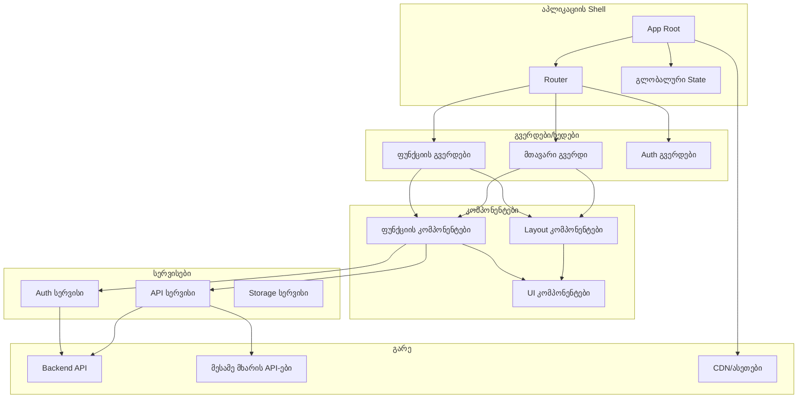
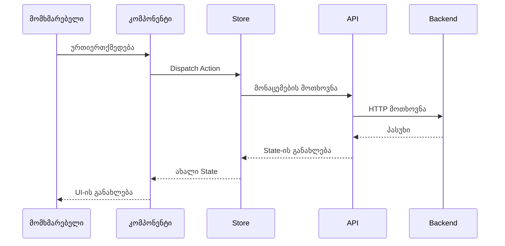
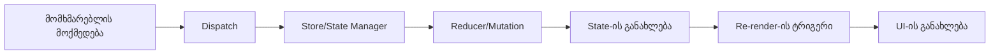
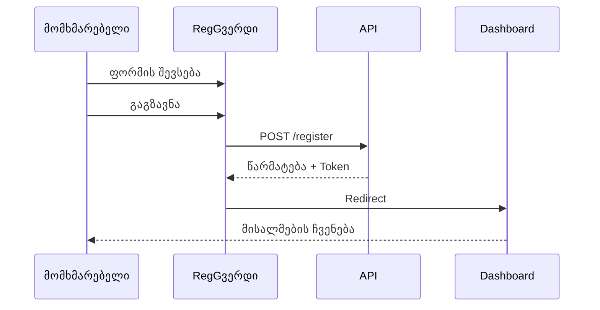

# {{PROJECT_NAME}} - Frontend SPA პროექტის გეგმა

*შექმნილია: {{CREATED_DATE}}*
*ბოლოს განახლებული: {{LAST_UPDATED}}*

## მიმოხილვა

**პროექტის სახელი**: {{PROJECT_NAME}}

**აღწერა**: {{DESCRIPTION}}

**სამიზნე მომხმარებლები**: {{TARGET_USERS}}

**პროექტის ტიპი**: Frontend Single Page Application

**სტატუსი**: {{STATUS}} ({{PROGRESS_PERCENT}}% დასრულებული)

---

## პრობლემის განცხადება

**მიმდინარე პრობლემები:**
{{PAIN_POINTS}}

**გადაწყვეტა:**
{{SOLUTION}}

**მთავარი ფუნქციები:**
{{KEY_FEATURES}}

---

## არქიტექტურა

### კომპონენტების არქიტექტურა



### მონაცემთა ნაკადი



### State Management



---

## ტექნოლოგიური სტეკი

### ძირითადი Framework
- **Framework**: {{FRONTEND_FRAMEWORK}} (React, Vue, Angular, Svelte, Solid)
- **ენა**: TypeScript
- **Build Tool**: {{BUILD_TOOL}} (Vite, Webpack, Turbopack, esbuild)
- **Package Manager**: {{PACKAGE_MANAGER}} (npm, yarn, pnpm, bun)

### State Management
- **გადაწყვეტა**: {{STATE_MANAGEMENT}} (Redux Toolkit, Zustand, Pinia, Vuex, NgRx, Jotai)
- **Server State**: {{SERVER_STATE}} (TanStack Query, SWR, Apollo Client, RTK Query)
- **Form State**: React Hook Form / Formik / Vee-Validate

### სტილიზაცია და UI
- **CSS გადაწყვეტა**: {{STYLING}} (Tailwind CSS, CSS Modules, Styled Components, Emotion, Sass)
- **UI Library**: {{UI_LIBRARY}} (Shadcn/ui, Material-UI, Chakra UI, Ant Design, Vuetify)
- **იკონები**: {{ICONS}} (Lucide, Heroicons, Font Awesome, Material Icons)
- **ანიმაციები**: {{ANIMATIONS}} (Framer Motion, GSAP, CSS Animations, Transition.js)

### Routing
- **Router**: {{ROUTER}} (React Router, Vue Router, Angular Router, TanStack Router)
- **Route დაცვა**: Auth guards/middleware
- **Code Splitting**: დინამიური imports route-ებისთვის

### მონაცემების მოთხოვნა
- **HTTP კლიენტი**: {{HTTP_CLIENT}} (Axios, Fetch API, ky)
- **WebSockets**: {{WEBSOCKET}} (Socket.io-client, native WebSocket)
- **GraphQL**: {{GRAPHQL}} (Apollo Client, URQL, Relay - საჭიროების შემთხვევაში)

### შემუშავების ხელსაწყოები
- **Version Control**: Git + GitHub
- **კოდის ხარისხი**: ESLint + Prettier
- **Type Checking**: TypeScript strict mode
- **Dev Server**: {{DEV_SERVER}} (Vite dev server, Webpack dev server)
- **API Mocking**: {{MOCKING}} (MSW, Mirage JS, JSON Server)

### ტესტირება
- **Unit Tests**: {{UNIT_TEST}} (Vitest, Jest)
- **კომპონენტის ტესტები**: {{COMPONENT_TEST}} (Testing Library, Vitest, Vue Test Utils)
- **E2E Tests**: {{E2E_TEST}} (Playwright, Cypress, WebdriverIO)
- **Visual Regression**: {{VISUAL_TEST}} (Chromatic, Percy - არასავალდებულო)

### Build და დეპლოიმენტი
- **ჰოსტინგი**: {{HOSTING}} (Vercel, Netlify, Cloudflare Pages, AWS S3)
- **CI/CD**: GitHub Actions / GitLab CI
- **გარემო**: .env ფაილები კონფიგურაციისთვის
- **PWA**: {{PWA}} (Workbox, vite-plugin-pwa - საჭიროების შემთხვევაში)

### შესრულება და მონიტორინგი
- **ანალიტიკა**: {{ANALYTICS}} (Google Analytics, Mixpanel, PostHog, Plausible)
- **Error Tracking**: {{ERROR_TRACKING}} (Sentry, LogRocket, Rollbar)
- **შესრულება**: {{PERFORMANCE}} (Web Vitals, Lighthouse CI)
- **Bundle ანალიზი**: {{BUNDLE_ANALYZER}} (Vite Bundle Visualizer, webpack-bundle-analyzer)

---

## პროექტის სტრუქტურა

```
{{PROJECT_NAME}}/
├── public/                   # სტატიკური ასეთები
│   ├── favicon.ico
│   └── robots.txt
│
├── src/
│   ├── components/          # მრავალჯერადი გამოყენების კომპონენტები
│   │   ├── ui/             # ძირითადი UI კომპონენტები
│   │   │   ├── Button/
│   │   │   ├── Input/
│   │   │   └── ...
│   │   ├── layout/         # Layout კომპონენტები
│   │   │   ├── Header/
│   │   │   ├── Sidebar/
│   │   │   └── Footer/
│   │   └── features/       # ფუნქციის-სპეციფიკური კომპონენტები
│   │       └── ...
│   │
│   ├── pages/              # გვერდის კომპონენტები
│   │   ├── Home/
│   │   ├── About/
│   │   ├── Dashboard/
│   │   └── ...
│   │
│   ├── hooks/              # Custom React hooks
│   │   ├── useAuth.ts
│   │   ├── useAPI.ts
│   │   └── ...
│   │
│   ├── store/              # State management
│   │   ├── index.ts
│   │   ├── slices/
│   │   └── hooks.ts
│   │
│   ├── services/           # API service შრე
│   │   ├── api.ts
│   │   ├── auth.service.ts
│   │   └── ...
│   │
│   ├── utils/              # დამხმარე ფუნქციები
│   │   ├── validators.ts
│   │   ├── formatters.ts
│   │   └── ...
│   │
│   ├── types/              # TypeScript ტიპები
│   │   ├── models.ts
│   │   └── api.ts
│   │
│   ├── constants/          # აპლიკაციის კონსტანტები
│   │   └── index.ts
│   │
│   ├── assets/             # სურათები, ფონტები და ა.შ.
│   │   ├── images/
│   │   └── fonts/
│   │
│   ├── styles/             # გლობალური სტილები
│   │   ├── index.css
│   │   └── variables.css
│   │
│   ├── routes/             # Route კონფიგურაცია
│   │   └── index.tsx
│   │
│   ├── App.tsx             # Root კომპონენტი
│   ├── main.tsx            # შესასვლელი წერტილი
│   └── vite-env.d.ts
│
├── tests/                  # ტესტის ფაილები
│   ├── unit/
│   ├── integration/
│   └── e2e/
│
├── .env.example           # გარემოს ცვლადების template
├── .eslintrc.json
├── .prettierrc
├── .gitignore
├── index.html
├── package.json
├── tsconfig.json
├── vite.config.ts
└── README.md
```

---

## ამოცანები და იმპლემენტაციის გეგმა

### ეტაპი 1: საფუძველი (შეფასება: {{PHASE1_ESTIMATE}})

#### T1.1: პროექტის დაყენება
- [ ] **სტატუსი**: TODO
- **სირთულე**: დაბალი
- **შეფასებული**: 1.5 საათი
- **დამოკიდებულებები**: არა
- **აღწერა**:
  - {{FRONTEND_FRAMEWORK}} პროექტის ინიციალიზება {{BUILD_TOOL}}-ით
  - TypeScript-ის კონფიგურაცია (strict mode)
  - ESLint + Prettier-ის დაყენება
  - Path alias-ების კონფიგურაცია (@components, @utils, და ა.შ.)
  - .env.example-ის შექმნა
  - Git რეპოზიტორიის ინიციალიზება
  - ძირითადი პროექტის სტრუქტურის შექმნა

#### T1.2: Routing-ის დაყენება
- [ ] **სტატუსი**: TODO
- **სირთულე**: დაბალი
- **შეფასებული**: 2 საათი
- **დამოკიდებულებები**: T1.1
- **აღწერა**:
  - {{ROUTER}}-ის დაყენება
  - Route კონფიგურაციის შექმნა
  - Layout კომპონენტების იმპლემენტაცია
  - 404 გვერდის დამატება
  - Auth-ისთვის route guards-ების დაყენება
  - Route-ებისთვის loading state-ების დამატება

#### T1.3: სტილიზაციის სისტემა
- [ ] **სტატუსი**: TODO
- **სირთულე**: საშუალო
- **შეფასებული**: 3 საათი
- **დამოკიდებულებები**: T1.1
- **აღწერა**:
  - {{STYLING}}-ის დაყენება (Tailwind CSS / Styled Components)
  - Theme-ის კონფიგურაცია (ფერები, ფონტები, spacing)
  - გლობალური სტილების შექმნა
  - Responsive breakpoint-ების დაყენება
  - Dark mode მხარდაჭერის დამატება (არასავალდებულო)
  - ძირითადი UI კომპონენტების შექმნა (Button, Input, Card, და ა.შ.)

#### T1.4: API ინტეგრაციის დაყენება
- [ ] **სტატუსი**: TODO
- **სირთულე**: საშუალო
- **შეფასებული**: 3 საათი
- **დამოკიდებულებები**: T1.1
- **აღწერა**:
  - {{HTTP_CLIENT}}-ის დაყენება (Axios / Fetch wrapper)
  - API service base-ის შექმნა
  - Request/response interceptor-ების დამატება
  - Error handling-ის იმპლემენტაცია
  - {{SERVER_STATE}}-ის დაყენება (TanStack Query / SWR)
  - Loading და error state-ების დამატება
  - Base URL-ის კონფიგურაცია env-დან

---

### ეტაპი 2: ავთენტიფიკაცია და State (შეფასება: {{PHASE2_ESTIMATE}})

#### T2.1: State Management
- [ ] **სტატუსი**: TODO
- **სირთულე**: საშუალო
- **შეფასებული**: 4 საათი
- **დამოკიდებულებები**: T1.1
- **აღწერა**:
  - {{STATE_MANAGEMENT}} store-ის დაყენება
  - Store slices/modules-ების შექმნა
  - Typed hooks-ების დამატება store access-ისთვის
  - Store persistence-ის იმპლემენტაცია (საჭიროების შემთხვევაში)
  - DevTools ინტეგრაციის დამატება
  - Selectors-ების შექმნა

#### T2.2: ავთენტიფიკაციის სისტემა
- [ ] **სტატუსი**: TODO
- **სირთულე**: მაღალი
- **შეფასებული**: 6 საათი
- **დამოკიდებულებები**: T1.4, T2.1
- **აღწერა**:
  - Login/register გვერდების შექმნა
  - Auth service-ის იმპლემენტაცია
  - Token storage-ის დამატება (localStorage/cookies)
  - Auth context/store-ის შექმნა
  - დაცული route-ების იმპლემენტაცია
  - Logout ფუნქციონალობის დამატება
  - Token refresh-ის მართვა
  - "Remember me" ფუნქციის დამატება

#### T2.3: მომხმარებლის პროფილი და პარამეტრები
- [ ] **სტატუსი**: TODO
- **სირთულე**: საშუალო
- **შეფასებული**: 4 საათი
- **დამოკიდებულებები**: T2.2
- **აღწერა**:
  - პროფილის გვერდის შექმნა
  - პროფილის რედაქტირების იმპლემენტაცია
  - Avatar upload-ის დამატება
  - პარამეტრების გვერდის შექმნა
  - პაროლის შეცვლის ფუნქციონალობის დამატება
  - ანგარიშის წაშლის იმპლემენტაცია

---

### ეტაპი 3: ძირითადი ფუნქციები (შეფასება: {{PHASE3_ESTIMATE}})

{{CORE_FEATURES_TASKS}}

---

### ეტაპი 4: დახვეწა და ოპტიმიზაცია (შეფასება: {{PHASE4_ESTIMATE}})

#### T4.1: შესრულების ოპტიმიზაცია
- [ ] **სტატუსი**: TODO
- **სირთულე**: საშუალო
- **შეფასებული**: 4 საათი
- **აღწერა**:
  - Code splitting-ის იმპლემენტაცია route-ებისთვის
  - კომპონენტებისთვის lazy loading-ის დამატება
  - სურათების ოპტიმიზაცია (WebP, lazy loading)
  - Virtual scrolling-ის იმპლემენტაცია (საჭიროების შემთხვევაში)
  - Bundle size ანალიზის დამატება
  - Re-render-ების ოპტიმიზაცია
  - React.memo / useMemo-ს დამატება საჭიროების შემთხვევაში

#### T4.2: Accessibility (a11y)
- [ ] **სტატუსი**: TODO
- **სირთულე**: საშუალო
- **შეფასებული**: 3 საათი
- **აღწერა**:
  - ARIA labels-ების დამატება
  - კლავიატურის ნავიგაციის უზრუნველყოფა
  - Focus management-ის დამატება
  - Screen reader-ებით ტესტირება
  - სწორი ფერის კონტრასტის უზრუნველყოფა
  - Skip links-ების დამატება
  - Lighthouse accessibility audit-ის ჩატარება

#### T4.3: შეცდომების დამუშავება და Loading State-ები
- [ ] **სტატუსი**: TODO
- **სირთულე**: საშუალო
- **შეფასებული**: 3 საათი
- **აღწერა**:
  - Error boundary კომპონენტების შექმნა
  - გლობალური error handler-ის დამატება
  - თანმიმდევრული loading state-ების შექმნა
  - Skeleton screen-ების დამატება
  - Retry ლოგიკის იმპლემენტაცია
  - Offline detection-ის შექმნა
  - Toast/notification სისტემის დამატება

#### T4.4: ტესტირების პაკეტი
- [ ] **სტატუსი**: TODO
- **სირთულე**: მაღალი
- **შეფასებული**: 8 საათი
- **აღწერა**:
  - Utils/services-ისთვის unit ტესტების დაწერა
  - კომპონენტის ტესტების დაწერა
  - კრიტიკული flow-ებისთვის E2E ტესტების დამატება
  - Test coverage reporting-ის დაყენება
  - API response-ების Mock-ირება
  - Accessibility-ის ტესტირება
  - Visual regression ტესტების დამატება (არასავალდებულო)

#### T4.5: დოკუმენტაცია და დეპლოიმენტი
- [ ] **სტატუსი**: TODO
- **სირთულე**: დაბალი
- **შეფასებული**: 2 საათი
- **დამოკიდებულებები**: T4.4
- **აღწერა**:
  - ყოვლისმომცველი README-ის დაწერა
  - კომპონენტის დოკუმენტაციის დამატება
  - დეპლოიმენტის გზამკვლევის შექმნა
  - CI/CD pipeline-ის დაყენება
  - გარემოს ცვლადების კონფიგურაცია
  - {{HOSTING}}-ზე დეპლოიმენტი
  - ანალიტიკის დაყენება
  - Error tracking-ის დაყენება

---

## პროგრესის თვალყურის დევნება

### საერთო სტატუსი
**სულ ამოცანები**: {{TOTAL_TASKS}}
**დასრულებული**: {{COMPLETED_TASKS}} {{PROGRESS_BAR}} ({{PROGRESS_PERCENT}}%)
**მიმდინარე**: {{IN_PROGRESS_TASKS}}
**დაბლოკილი**: {{BLOCKED_TASKS}}

### ეტაპების პროგრესი
- ეტაპი 1: საფუძველი → {{PHASE1_PROGRESS}}%
- ეტაპი 2: ავთენტიფიკაცია და State → {{PHASE2_PROGRESS}}%
- ეტაპი 3: ძირითადი ფუნქციები → {{PHASE3_PROGRESS}}%
- ეტაპი 4: დახვეწა და ოპტიმიზაცია → {{PHASE4_PROGRESS}}%

### მიმდინარე ფოკუსი
{{CURRENT_FOCUS}}

---

## დიზაინის სისტემა

### ფერთა პალიტრა
```css
{{COLOR_PALETTE}}
```

### ტიპოგრაფია
```css
{{TYPOGRAPHY}}
```

### Spacing სკალა
```css
{{SPACING}}
```

### კომპონენტის ვარიანტები
{{COMPONENT_VARIANTS}}

---

## მთავარი მომხმარებლის Flow-ები

### მომხმარებლის რეგისტრაციის Flow


### {{MAIN_FEATURE}} Flow
{{MAIN_FEATURE_FLOW}}

---

## წარმატების კრიტერიუმები

### Minimum Viable Product (MVP)
- Responsive დიზაინი (mobile, tablet, desktop)
- მომხმარებლის ავთენტიფიკაცია მუშაობს
- ძირითადი ფუნქციები ფუნქციონირებს
- სწორი error handling
- Loading state-ები იმპლემენტირებული
- Production-ში დეპლოიმენტი
- ძირითადი ანალიტიკა მუშაობს

### სასურველი (v1.1+)
{{NICE_TO_HAVE}}

---

## ტექნიკური გადაწყვეტილებები და შენიშვნები

### რატომ {{FRONTEND_FRAMEWORK}}?
{{FRONTEND_REASONING}}

### რატომ {{STATE_MANAGEMENT}}?
{{STATE_REASONING}}

### რატომ {{STYLING}}?
{{STYLING_REASONING}}

### კომპონენტის დიზაინის პრინციპები
{{COMPONENT_PRINCIPLES}}

---

## რესურსები და მითითებები

### დოკუმენტაცია
- [{{FRONTEND_FRAMEWORK}} დოკუმენტაცია]({{FRAMEWORK_DOCS_URL}})
- [{{UI_LIBRARY}} დოკუმენტაცია]({{UI_DOCS_URL}})
- [{{STATE_MANAGEMENT}} დოკუმენტაცია]({{STATE_DOCS_URL}})

### დიზაინის რესურსები
{{DESIGN_RESOURCES}}

### ხელსაწყოები და ბიბლიოთეკები
{{TOOLS_LIBRARIES}}

---

## შესრულების მაჩვენებლები

### სამიზნე მეტრიკები
- **First Contentful Paint**: < 1.5s
- **Time to Interactive**: < 3.5s
- **Largest Contentful Paint**: < 2.5s
- **Cumulative Layout Shift**: < 0.1
- **First Input Delay**: < 100ms
- **Lighthouse ქულა**: > 90

### Bundle Size მიზნები
- **საწყისი Bundle**: < 200KB gzipped
- **სულ JS**: < 500KB gzipped
- **სულ CSS**: < 50KB gzipped

---

## ბრაუზერის მხარდაჭერა

### სამიზნე ბრაუზერები
- Chrome (ბოლო 2 ვერსია)
- Firefox (ბოლო 2 ვერსია)
- Safari (ბოლო 2 ვერსია)
- Edge (ბოლო 2 ვერსია)
- {{ADDITIONAL_BROWSERS}}

### მობილური მხარდაჭერა
- iOS Safari (ბოლო 2 ვერსია)
- Chrome Mobile (ბოლო 2 ვერსია)

---

## რისკების მართვა

### პოტენციური რისკები
1. **შესრულება**: დიდი bundle ზომა გავლენას ახდენს ჩატვირთვის დროზე
   - **შემსუბუქება**: Code splitting, lazy loading, bundle ანალიზი
2. **ბრაუზერის თავსებადობა**: ფუნქციები მხარდაჭერილი არ არის ძველ ბრაუზერებში
   - **შემსუბუქება**: Polyfills, progressive enhancement, graceful degradation
3. **უსაფრთხოება**: XSS მოწყვლადობები
   - **შემსუბუქება**: მომხმარებლის input-ის სანიტარიზება, framework-ის უსაფრთხოების ფუნქციების გამოყენება, CSP headers

{{ADDITIONAL_RISKS}}

---

## მომავალი გაუმჯობესებები

{{FUTURE_ENHANCEMENTS}}

---

*შექმნილია plan-plugin v{{PLUGIN_VERSION}}-ით*
