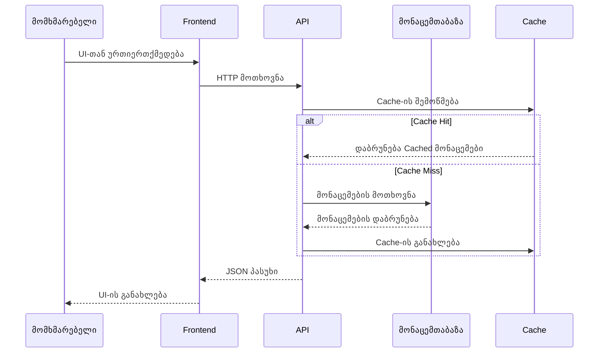

# {{PROJECT_NAME}} - Full-Stack პროექტის გეგმა

*შექმნილია: {{CREATED_DATE}}*
*ბოლოს განახლებული: {{LAST_UPDATED}}*

## მიმოხილვა

**პროექტის სახელი**: {{PROJECT_NAME}}

**აღწერა**: {{DESCRIPTION}}

**სამიზნე მომხმარებლები**: {{TARGET_USERS}}

**პროექტის ტიპი**: Full-Stack ვებ აპლიკაცია

**სტატუსი**: {{STATUS}} ({{PROGRESS_PERCENT}}% დასრულებული)

---

## პრობლემის განცხადება

**მიმდინარე პრობლემები:**
{{PAIN_POINTS}}

**გადაწყვეტა:**
{{SOLUTION}}

**მთავარი ფუნქციები:**
{{KEY_FEATURES}}

---

## არქიტექტურა

### სისტემის მიმოხილვა

```mermaid
graph TB
    subgraph "კლიენტის შრე"
        A[ვებ ბრაუზერი]
        B[მობილური ბრაუზერი]
    end

    subgraph "Frontend"
        C[{{FRONTEND_FRAMEWORK}}]
        D[State მართვა]
        E[UI კომპონენტები]
    end

    subgraph "Backend"
        F[API სერვერი<br/>{{BACKEND_FRAMEWORK}}]
        G[ავთენტიფიკაცია]
        H[ბიზნეს ლოგიკა]
    end

    subgraph "მონაცემთა შრე"
        I[{{DATABASE}}]
        J[Cache<br/>Redis]
        K[ფაილების საცავი]
    end

    subgraph "გარე სერვისები"
        L[Email სერვისი]
        M[გადახდის Gateway]
        N[მესამე მხარის API-ები]
    end

    A --> C
    B --> C
    C --> D
    C --> E
    E --> F
    F --> G
    F --> H
    H --> I
    H --> J
    F --> K
    F --> L
    F --> M
    F --> N
```

### მონაცემთა ნაკადი



---

## ტექნოლოგიური სტეკი

### Frontend
- **Framework**: {{FRONTEND_FRAMEWORK}} (React, Vue, Angular, Svelte)
- **ენა**: TypeScript
- **State Management**: {{STATE_MANAGEMENT}} (Redux, Zustand, Pinia, და ა.შ.)
- **სტილიზაცია**: {{STYLING}} (Tailwind CSS, Styled Components, CSS Modules)
- **Build Tool**: Vite / Webpack
- **UI Library**: {{UI_LIBRARY}} (Shadcn, MUI, Chakra UI, და ა.შ.)
- **ფორმები**: React Hook Form / Formik
- **Data Fetching**: TanStack Query / SWR / Apollo Client

### Backend
- **Framework**: {{BACKEND_FRAMEWORK}} (Express.js, NestJS, Fastify, Django, Flask)
- **ენა**: {{BACKEND_LANGUAGE}} (TypeScript, Python, Go)
- **ავთენტიფიკაცია**: JWT + OAuth 2.0
- **ვალიდაცია**: Zod / Joi / Pydantic
- **ORM**: {{ORM}} (Prisma, TypeORM, Sequelize, SQLAlchemy)
- **API სტილი**: REST / GraphQL / tRPC

### მონაცემთა ბაზა
- **ძირითადი**: {{DATABASE}} (PostgreSQL, MySQL, MongoDB)
- **Cache**: Redis
- **ძებნა**: {{SEARCH_ENGINE}} (Elasticsearch, Algolia - საჭიროების შემთხვევაში)
- **ფაილების საცავი**: {{STORAGE}} (AWS S3, Cloudinary, ლოკალური)

### DevOps და ინფრასტრუქტურა
- **ჰოსტინგი**: {{HOSTING}} (Vercel, AWS, DigitalOcean, Railway)
- **CI/CD**: GitHub Actions / GitLab CI
- **კონტეინერიზაცია**: Docker + Docker Compose
- **მონიტორინგი**: {{MONITORING}} (Sentry, LogRocket, Datadog)
- **ანალიტიკა**: {{ANALYTICS}} (Google Analytics, Mixpanel, PostHog)

### შემუშავების ხელსაწყოები
- **Version Control**: Git + GitHub
- **Package Manager**: {{PACKAGE_MANAGER}} (npm, yarn, pnpm)
- **კოდის ხარისხი**: ESLint + Prettier
- **API Testing**: Postman / Insomnia / Thunder Client
- **მონაცემთა ბაზის კლიენტი**: {{DB_CLIENT}} (pgAdmin, MongoDB Compass, DataGrip)

### ტესტირება
- **Unit Tests**: {{UNIT_TEST}} (Vitest, Jest, pytest)
- **Integration Tests**: Supertest / TestContainers
- **E2E Tests**: {{E2E_TEST}} (Playwright, Cypress)
- **API Testing**: Postman Collections / Newman

---

## პროექტის სტრუქტურა

```
{{PROJECT_NAME}}/
├── frontend/                  # Frontend აპლიკაცია
│   ├── src/
│   │   ├── components/       # მრავალჯერადი გამოყენების UI კომპონენტები
│   │   ├── pages/            # გვერდის კომპონენტები
│   │   ├── hooks/            # Custom React hooks
│   │   ├── store/            # State management
│   │   ├── services/         # API service შრე
│   │   ├── utils/            # დამხმარე ფუნქციები
│   │   ├── types/            # TypeScript ტიპები
│   │   ├── assets/           # სტატიკური ასეთები
│   │   └── App.tsx           # Root კომპონენტი
│   ├── public/               # Public ასეთები
│   ├── package.json
│   └── vite.config.ts
│
├── backend/                   # Backend აპლიკაცია
│   ├── src/
│   │   ├── controllers/      # Request handlers
│   │   ├── services/         # ბიზნეს ლოგიკა
│   │   ├── models/           # მონაცემთა მოდელები
│   │   ├── routes/           # API routes
│   │   ├── middleware/       # Custom middleware
│   │   ├── utils/            # დამხმარე ფუნქციები
│   │   ├── config/           # კონფიგურაცია
│   │   └── index.ts          # შესასვლელი წერტილი
│   ├── tests/                # ტესტის ფაილები
│   ├── package.json
│   └── tsconfig.json
│
├── shared/                    # გაზიარებული კოდი (ტიპები, კონსტანტები)
│   └── types.ts
│
├── docker-compose.yml         # ლოკალური გარემოს დაყენება
├── .env.example              # გარემოს ცვლადების template
├── .gitignore
└── README.md
```

---

## ამოცანები და იმპლემენტაციის გეგმა

### ეტაპი 1: საფუძველი (შეფასება: {{PHASE1_ESTIMATE}})

#### T1.1: პროექტის დაყენება
- [ ] **სტატუსი**: TODO
- **სირთულე**: დაბალი
- **შეფასებული**: 2 საათი
- **დამოკიდებულებები**: არა
- **აღწერა**:
  - Frontend პროექტის ინიციალიზება ({{FRONTEND_FRAMEWORK}})
  - Backend პროექტის ინიციალიზება ({{BACKEND_FRAMEWORK}})
  - Monorepo სტრუქტურის დაყენება (საჭიროების შემთხვევაში)
  - TypeScript-ის კონფიგურაცია
  - ESLint + Prettier-ის დაყენება
  - .env.example ფაილების შექმნა
  - Git რეპოზიტორიის ინიციალიზება

#### T1.2: მონაცემთა ბაზის დაყენება
- [ ] **სტატუსი**: TODO
- **სირთულე**: დაბალი
- **შეფასებული**: 2 საათი
- **დამოკიდებულებები**: T1.1
- **აღწერა**:
  - {{DATABASE}} მონაცემთა ბაზის დაყენება
  - ORM-ის კონფიგურაცია ({{ORM}})
  - საწყისი სქემის/მოდელების შექმნა
  - Migration-ების დაყენება
  - Seed data სკრიპტების შექმნა
  - Redis-ის კონფიგურაცია caching-ისთვის

#### T1.3: ავთენტიფიკაციის სისტემა
- [ ] **სტატუსი**: TODO
- **სირთულე**: მაღალი
- **შეფასებული**: 6 საათი
- **დამოკიდებულებები**: T1.2
- **აღწერა**:
  - JWT ავთენტიფიკაციის იმპლემენტაცია
  - User მოდელის შექმნა
  - პაროლის ჰეშირების დაყენება
  - Login/register endpoint-ების შექმნა
  - Auth middleware-ის შექმნა
  - OAuth პროვაიდერების დამატება (Google, GitHub)
  - Frontend login/register ფორმები
  - დაცული route-ების მართვა

#### T1.4: API-ის ძირითადი სტრუქტურა
- [ ] **სტატუსი**: TODO
- **სირთულე**: საშუალო
- **შეფასებული**: 4 საათი
- **დამოკიდებულებები**: T1.2
- **აღწერა**:
  - Express router სტრუქტურის დაყენება
  - ძირითადი CRUD endpoint-ების შექმნა
  - Request validation-ის დამატება
  - Error handling-ის იმპლემენტაცია
  - API დოკუმენტაციის დამატება (Swagger/OpenAPI)
  - CORS კონფიგურაციის დაყენება

---

### ეტაპი 2: ძირითადი ფუნქციები (შეფასება: {{PHASE2_ESTIMATE}})

{{CORE_FEATURES_TASKS}}

---

### ეტაპი 3: გაფართოებული ფუნქციები (შეფასება: {{PHASE3_ESTIMATE}})

{{ADVANCED_FEATURES_TASKS}}

---

### ეტაპი 4: ტესტირება და დეპლოიმენტი (შეფასება: {{PHASE4_ESTIMATE}})

#### T4.1: ტესტირების პაკეტი
- [ ] **სტატუსი**: TODO
- **სირთულე**: მაღალი
- **შეფასებული**: 8 საათი
- **აღწერა**:
  - Unit ტესტების დაწერა სერვისებისთვის
  - Integration ტესტების დაწერა API-სთვის
  - E2E ტესტების დაწერა კრიტიკული flow-ებისთვის
  - Test coverage reporting-ის დაყენება
  - ტესტების დამატება CI/CD pipeline-ში

#### T4.2: დეპლოიმენტის დაყენება
- [ ] **სტატუსი**: TODO
- **სირთულე**: საშუალო
- **შეფასებული**: 4 საათი
- **დამოკიდებულებები**: T4.1
- **აღწერა**:
  - Production გარემოს კონფიგურაცია
  - Docker container-ების დაყენება
  - CI/CD pipeline-ის კონფიგურაცია
  - მონაცემთა ბაზის backup-ების დაყენება
  - მონიტორინგისა და ლოგირების კონფიგურაცია
  - Error tracking-ის დამატება (Sentry)
  - {{HOSTING}}-ზე დეპლოიმენტი

#### T4.3: დოკუმენტაცია და დახვეწა
- [ ] **სტატუსი**: TODO
- **სირთულე**: საშუალო
- **შეფასებული**: 3 საათი
- **დამოკიდებულებები**: T4.2
- **აღწერა**:
  - ყოვლისმომცველი README-ის დაწერა
  - API დოკუმენტაციის დამატება
  - დეპლოიმენტის გზამკვლევის შექმნა
  - Contribution guidelines-ის დამატება
  - მომხმარებლის დოკუმენტაციის დაწერა
  - დემო ვიდეოს ჩაწერა

---

## პროგრესის თვალყურის დევნება

### საერთო სტატუსი
**სულ ამოცანები**: {{TOTAL_TASKS}}
**დასრულებული**: {{COMPLETED_TASKS}} {{PROGRESS_BAR}} ({{PROGRESS_PERCENT}}%)
**მიმდინარე**: {{IN_PROGRESS_TASKS}}
**დაბლოკილი**: {{BLOCKED_TASKS}}

### ეტაპების პროგრესი
- ეტაპი 1: საფუძველი → {{PHASE1_PROGRESS}}%
- ეტაპი 2: ძირითადი ფუნქციები → {{PHASE2_PROGRESS}}%
- ეტაპი 3: გაფართოებული ფუნქციები → {{PHASE3_PROGRESS}}%
- ეტაპი 4: ტესტირება და დეპლოიმენტი → {{PHASE4_PROGRESS}}%

### მიმდინარე ფოკუსი
{{CURRENT_FOCUS}}

---

## წარმატების კრიტერიუმები

### Minimum Viable Product (MVP)
- მომხმარებლის ავთენტიფიკაცია და ავტორიზაცია მუშაობს
- ძირითადი CRUD ოპერაციები ფუნქციონირებს
- ადაპტური UI desktop-სა და mobile-ზე
- ძირითადი error handling და ვალიდაცია
- Production გარემოში დეპლოიმენტი

### სასურველი (v1.1+)
{{NICE_TO_HAVE}}

---

## ტექნიკური გადაწყვეტილებები და შენიშვნები

### რატომ {{FRONTEND_FRAMEWORK}}?
{{FRONTEND_REASONING}}

### რატომ {{BACKEND_FRAMEWORK}}?
{{BACKEND_REASONING}}

### რატომ {{DATABASE}}?
{{DATABASE_REASONING}}

### API დიზაინის გადაწყვეტილებები
{{API_DECISIONS}}

---

## რესურსები და მითითებები

### დოკუმენტაცია
- [{{FRONTEND_FRAMEWORK}} დოკუმენტაცია]({{FRONTEND_DOCS_URL}})
- [{{BACKEND_FRAMEWORK}} დოკუმენტაცია]({{BACKEND_DOCS_URL}})
- [{{DATABASE}} დოკუმენტაცია]({{DATABASE_DOCS_URL}})

### ხელსაწყოები და ბიბლიოთეკები
{{TOOLS_LIBRARIES}}

---

## რისკების მართვა

### პოტენციური რისკები
1. **შესრულება**: მონაცემთა ბაზის მოთხოვნები შეიძლება იყოს ნელი დიდი მონაცემებით
   - **შემსუბუქება**: Database index-ების დამატება, caching-ის იმპლემენტაცია, pagination-ის გამოყენება
2. **უსაფრთხოება**: ავთენტიფიკაციის მოწყვლადობები
   - **შემსუბუქება**: დამკვიდრებული ბიბლიოთეკების გამოყენება, rate limiting-ის იმპლემენტაცია, რეგულარული უსაფრთხოების აუდიტი
3. **მასშტაბურობა**: აპლიკაცია შეიძლება არ მასშტაბდებოდეს ტრაფიკთან ერთად
   - **შემსუბუქება**: horizontal scaling-ის გათვალისწინებით დიზაინი, load balancing-ის გამოყენება

{{ADDITIONAL_RISKS}}

---

## მომავალი გაუმჯობესებები

{{FUTURE_ENHANCEMENTS}}

---

*შექმნილია plan-plugin v{{PLUGIN_VERSION}}-ით*
